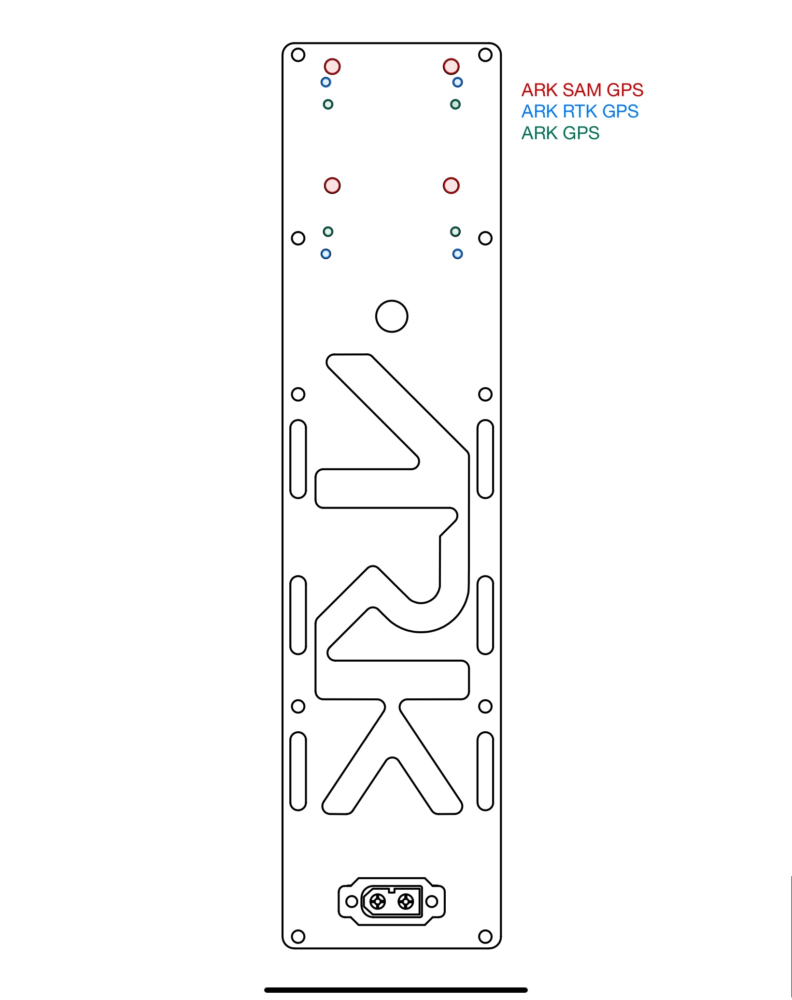
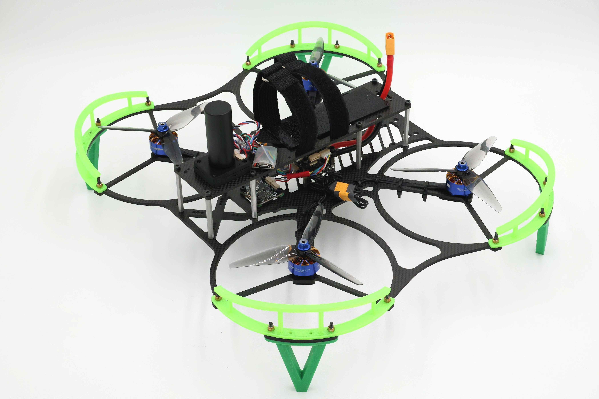
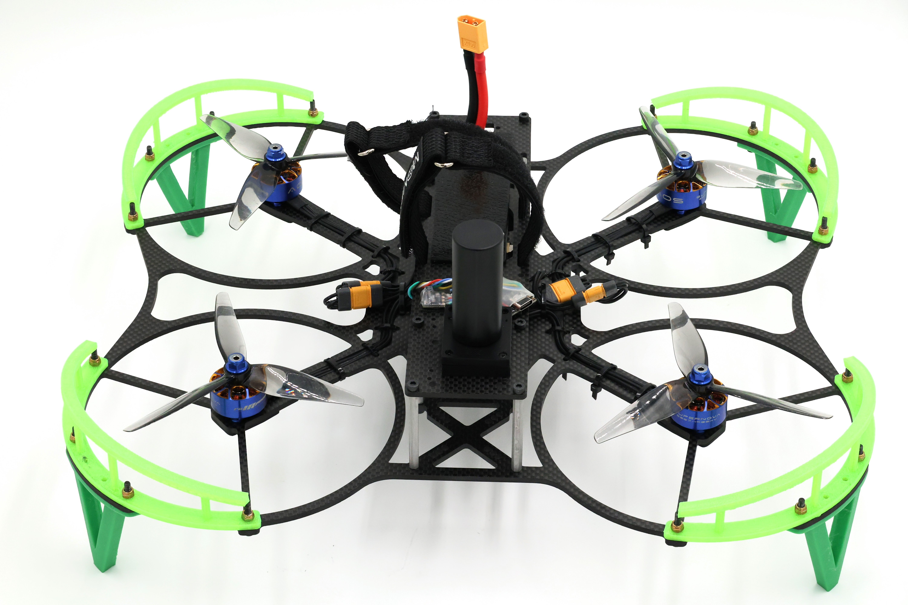
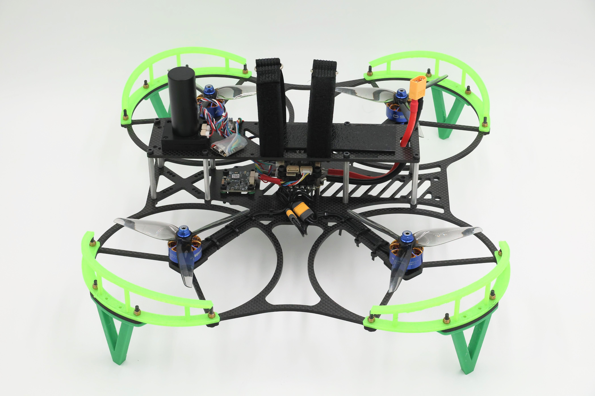
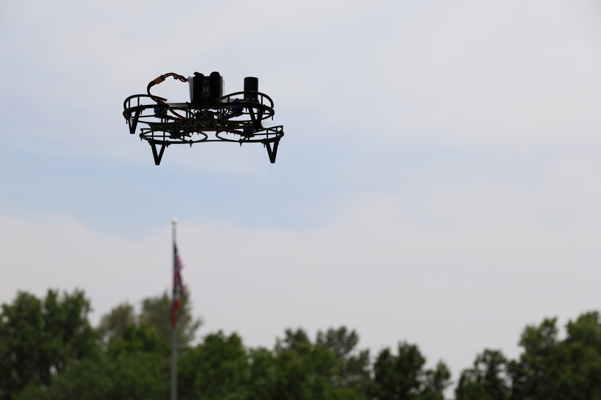

# ARK RIG5

### Build Guide



### Part List

| Part                           | Quantity | Component                         |
| ------------------------------ | -------- | --------------------------------- |
| Frame (top/bottom)             | 1        | N/A                               |
| M3x45 Standoff                 | 8        | Frame                             |
| M3x8 Screw                     | 32       | Frame/ESC/FPV FC                  |
| M3x16 Screw                    | 20       | Ark Flow/Landing Gear/Prop Guards |
| M3 Locknut                     | 20       | Ark Flow/Landing Gear/Prop Guards |
| M2x16 Screw                    | 4        | GPS                               |
| M2 Locknut                     | 4        | GPS                               |
| M3x10 Male-Female standoff     | 4        | Connecting FPV-ESC                |
| M3x10 Female-Female standoff   | 4        | Connecting ESC-Frame              |
| M2.5x10 Female-Female Standoff | 4        | Connecting PAB                    |
| M2.5x8 Screw                   | 8        | Connecting PAB                    |

**Printed Parts**

All printed parts are available on GitHub. They will be available as STEP files so that you can make any changes you want! The files will include:

* Landing gear
* Prop guards&#x20;
* Motor spacer
* Flow spacers

The frame will also be included so that you can modify it or just make it yourself if you have access to a CNC machine

3D models can be found here:\
[https://github.com/ARK-Electronics/ARK\_RIG5](https://github.com/ARK-Electronics/ARK_RIG5)

### Compatibility

#### Part List

**Flight controller options:**

* ARK FPV Flight Controller - [https://arkelectron.com/product/ark-fpv-flight-controller/](https://arkelectron.com/product/ark-fpv-flight-controller/)
* ARKV6X Bundle - [https://arkelectron.com/product/arkv6x-bundle/](https://arkelectron.com/product/arkv6x-bundle/)
* ARK Pi6X Flow - [https://arkelectron.com/product/ark-pi6x-flow/](https://arkelectron.com/product/ark-pi6x-flow/)
* ARK Pi6X - [https://arkelectron.com/product/ark-pi6x/](https://arkelectron.com/product/ark-pi6x/)

**ESC options:**

* ARK 4IN1 ESC - [https://arkelectron.com/product/ark-4in1-esc/](https://arkelectron.com/product/ark-4in1-esc/)
* ARK 4IN1 ESC CONS - [https://arkelectron.com/product/ark-4in1-esc-cons/](https://arkelectron.com/product/ark-4in1-esc-cons/)

**GPS options:**

* ARK GPS - [https://arkelectron.com/product/ark-gps/](https://arkelectron.com/product/ark-gps/)
* ARK RTK GPS - [https://arkelectron.com/product/ark-rtk-gps/](https://arkelectron.com/product/ark-rtk-gps/)
* ARK SAM GPS - [https://arkelectron.com/product/ark-sam-gps/](https://arkelectron.com/product/ark-sam-gps/)
* ARK TESEO GPS - [https://arkelectron.com/product/ark-teseo-gps/](https://arkelectron.com/product/ark-teseo-gps/)
* ARK SAM GPS MINI - [https://arkelectron.com/product/ark-sam-gps-mini/](https://arkelectron.com/product/ark-sam-gps-mini/)
* ARK DAN GPS - [https://arkelectron.com/product/ark-dan-gps/](https://arkelectron.com/product/ark-dan-gps/)

**Optical flow sensor options:**

* ARK Flow - [https://arkelectron.com/product/ark-flow/](https://arkelectron.com/product/ark-flow/)
* ARK Flow MR - [https://arkelectron.com/product/ark-flow-mr/](https://arkelectron.com/product/ark-flow-mr/)

**Addition components beyond ARK ecosystem:**

* 4 motors
* RC setup, we recommend ExpressLRS
* Battery
* Wifi module in case you are not using a Pi based FC\
  &#xNAN;_&#x44;roneBridge -_ [_https://drone-bridge.com/_](https://drone-bridge.com/)

<figure><figcaption>
Top Plate
</figcaption></figure>

**Mounting holes for top plate**

* SAM GPS - M3
* RTK GPS - M2
* ARK GPS - M2

<figure><figcaption>
Bottom Plate
</figcaption></figure>

**Mounting holes for bottom plate**

* FPV/ESC - M3
* Pi6x - M2
* PAB - M2.5
* Standoffs - M3

### Weight

| Frame | Full drone (No battery) | Full drone (with battery) |
| ----- | ----------------------- | ------------------------- |
| 186 g | 623 g                   | 1038 g                    |

### Build Guide Overview and Video Timestamps

**Step 1:** Identify and prepare components (0:10)

**Step 2:** Solder connectors on to ESC **if not using** connectorized ESC (2:51)

**Step 3:** Attach ESC to frame using 4 M3x8 screws and 4 F-F M3x10 standoffs (4:50)

**Step 4:** Attach FPV FC to ESC using 4 M-F M3x10 standoffs and 4 M3x8 screws (9:00)

* Connect ESC and FPV FC together with 8 pin JST-GH/JST-SH cable

**Step 5:** Attach the ARK Flow using 4 M3x16 screws and 4 M3 locknuts (12:14)

* Now would be a good time to attach a CAN cable to your flow. We'll come back to it later

**Step 6:** Attach all 4 motors using the hardware provided with the motors (17:30)

* **NOTE**: Your screws may be too long and short out the motors. If this is the case print out 4 spacers available in the print files to ensure there is no contact between the ends of the screws and the motor coils
* Once the motors are secured, zip tie the loose cables to the body and arms using the holes and notches in the arms

**Step 7:** Attach the 8 M3x45 standoffs to the body using 8 M3x8 screws (26:12)

* You can now either attach the top plate using 8 M3x8 screws, or you may prepare your top plate before attaching it to the standoffs

**Step 8:** Attach GPS to top plate using either 4 M2x16 screws and locknuts or 4 M3x16 locknuts, depending on which GPS you're using (37:35)

* If you want to print a case for the GPS, there should be downloadable STL files on the GitHub page for whichever GPS you are using
* **NOTE**: The top plate has mounting holes for the ARK GPS, ARK RTK GPS, and ARK SAM GPS. You may need to drill a different pattern if using a different GPS or use only two holes. Alternatively, you could secure the GPS to the top plate with an adhesive/double sided tape, however this is not recommended.
* Attach CAN cable and route it through the large hole in the top plate
* Route CAN cable from the flow up through the large hole&#x20;
* plug CAN cable from GPS into the CAN port on your flight controller&#x20;
* **NOTE**: If daisy-chaining the flow and GPS together, you may need to configure the parameter "CANNODE\_TERM" in QGroundControl

**Step 9:** Attach sticky battery pad (optional) and battery straps to top plate. (42:20)

**Step 10:** Secure top plate to the 8 standoffs using 8 M3x8 screws (30:12)

**Step 11:** Attach your RC module and Telemetry solution to the frame using zip ties or an adhesive (Telemetry solution not necessary if using Pi6x as it creates its own network) (44:17)

**Step 12:** Power the drone and configure it in QGroundControl or similar program (45:58)

### Gallery

<figure><figcaption></figcaption></figure>

<figure><figcaption></figcaption></figure>

<figure><figcaption></figcaption></figure>

<figure><figcaption></figcaption></figure>

