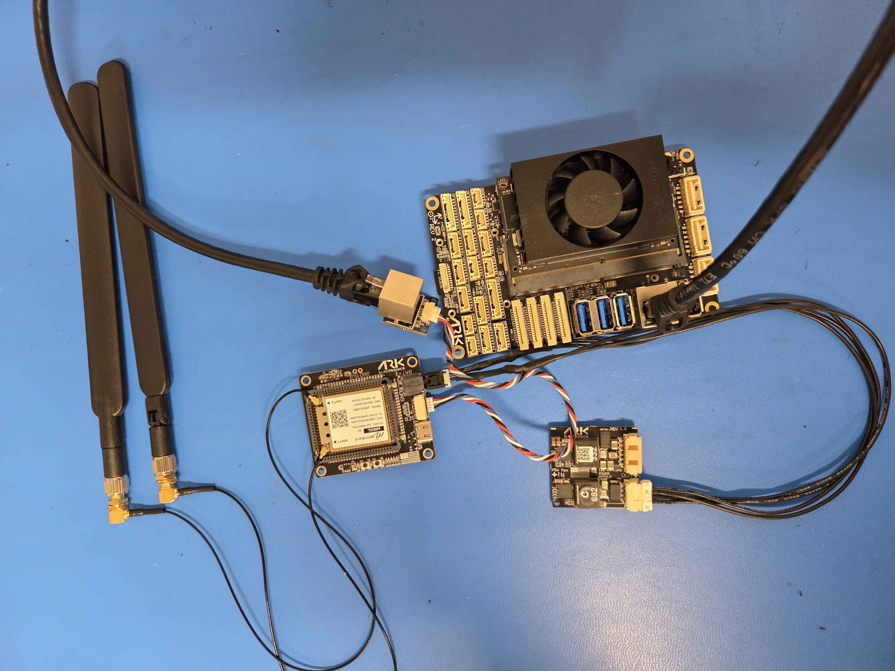

# ARK Microhard DDL Carrier Integration for ARK Jetson PAB Carrier



## Introduction

This guide provides step-by-step instructions for integrating the **Microhard pMDDL Digital Data Link (DDL) radio system** with the **ARK Jetson PAB Carrier**, enabling seamless deployment in UAV and robotic platforms.

It covers hardware connections, software configuration, and troubleshooting tips to establish a reliable, low-latency wireless link over a **private Microhard network**. **Standard IP networking** features such as point-to-point and point-to-multipoint operation, adaptive modulation, and robust error correction are leveraged to ensure resilient communication in dynamic environments.

Whether you're configuring a new vehicle or upgrading an existing system, this integration guide ensures a reliable connection between the **Jetson-based** companion computer and your ground control station—optimized for use with ROS 2, PX4, MAVLink, and other ARK Electronics software frameworks.

## Hardware setup

The **ARK Microhard DDL Carrier** requires external power to operate reliably. We recommend using the **ARK 12S Payload Power Module**, which provides regulated and protected power suitable for airborne and mobile robotics platforms.

In addition, to powering the **ARK Microhard DDL  Carrier**, use an Ethernet adapter to bridge the connection between the **Radio** and the **ARK Jetson PAB Carrier**. Connect the adapter to the radio's LAN port, and then use an Ethernet cable to connect to the **Jetson**. This setup enables high-throughput data exchange between the **Jetson** companion computer and the network established by the radio.

⚠️ Ensure all connections are secure and that antennas are properly attached to avoid damage during operation.

<figure><figcaption></figcaption></figure>

## Radio setup

This example requires **two pMDDL units**:

* One configured as a **Master (M)**
* One configured as a **Slave/Remote (S)**

This example demonstrates the basic steps required to set up each unit so that a simple network will be established.

#### Air unit

1. Connect the carrier to your PC using the USB C port.
2. Navigate to **192.168.168.1** in your browser
3. The pMDDL will then ask for a Username and Password. Enter the factory de-\
   faults listed below.\
   &#xNAN;_&#x54;he Factory default login:_\
   **User name: admin**\
   **Password: admin**\
   Once successfully logged in for the first\
   time, the pMDDL will force a password\
   change\

4.  Once successfully logged in, the System Summary window will be displayed.\


    <figure><figcaption></figcaption></figure>
5. Hover over **Network** settings and select **LAN**
6.  Edit the existing connection\


    <figure><figcaption></figcaption></figure>


7.  Enter the following Network Information:\
    **IP Address: 192.168.168.11**\
    **IP Subnet Mask: 255.255.255.0**\


    <figure><figcaption></figcaption></figure>

    Click on the Submit button to write the changes to the pMDDL. The Cancel button will revert back to last values saved to the unit.\
    **Once the IP Address is changed, you will need to type the new address into your browser to continue the configuration.**
8. Navigate to **192.168.168.11** in your browser and log in with the credential you set previously
9. Select **Wireless** , and then **RF** from the submenu list.
10. Set the RF Configuration\
    In the **RF Configuration** ensure the **Compatibility Mode, Channel Bandwidth and Channel-Frequency** are set the same on each module.\
    Select **Master** from the **Operation Mode dropdown box**.\
    Set a **Network ID**, which will need to be the same on each unit in the network.\
    This example uses **ARK**

    <figure><figcaption></figcaption></figure>

#### Ground unit

1. Connect the carrier to your PC using the USB C port.
2. Navigate to **192.168.168.1** in your browser
3. The pMDDL will then ask for a Username and Password. Enter the factory de-\
   faults listed below.\
   &#xNAN;_&#x54;he Factory default login:_\
   **User name: admin**\
   **Password: admin**\
   Once successfully logged in for the first time, the pMDDL will force a password change.
4.  Once successfully logged in, the System Summary window will be displayed.\


    <figure><figcaption></figcaption></figure>
5. Hover over **Network** settings and select **LAN**
6.  Edit the existing connection\


    <figure><figcaption></figcaption></figure>


7.  Enter the following Network Information:\
    **IP Address: 192.168.168.12**\
    **IP Subnet Mask: 255.255.255.0**\
    **Default Gateway: 192.168.168.11**\
    Click on the Submit button to write the changes to the pMDDL. The Cancel button will revert back to last values saved to the unit.\
    **Once the IP Address is changed, you will need to type the new address into your browser to continue the configuration.**

    <figure><figcaption></figcaption></figure>
8. Navigate to **192.168.168.12** in your browser and log in with the credential you set previously
9. Select **Wireless** , and then **RF** from the submenu list.
10. Set the RF Configuration\
    In the **RF Configuration** ensure the **Compatibility Mode, Channel Bandwidth and Channel-Frequency** are set the same on each module.\
    Select **Slave** from the **Operation Mode dropdown box**.\
    Set a **Network ID**, which will need to be the same on each unit in the network.\
    This example uses **ARK**\


    <figure><figcaption></figcaption></figure>

\
For best performance, the **Master unit** should be connected to the **Drone(Jetson)**, while the **Remote unit** should be connected to the **Ground Control Station(Your PC)**. The pMDDL system supports **Point-to-Multipoint applications**, meaning multiple remote units can be added to simultaneously view the same video stream from different locations.\
Once both radios are set up and powered they connect automatically. It can be observed in the **Wireless Status tab.**\


<figure><figcaption></figcaption></figure>

## Network setup

To configure your Microhard pMDDL radio for network communication, you must connect it to your host PC using an Ethernet adapter and cable.

After establishing a physical connection, assign a **static IP address** on your host machine within the **192.168.168.0/24 subnet** to enable communication with the radio network.

### Host PC

The process for assigning a static IP address depends on your operating system (Windows, macOS, Linux).

* **Host PC IP address**: `192.168.168.12`
* **Subnet mask**: `255.255.255.0`
* **Gateway**: `192.168.168.12`

⚠️ **Note:** IP addresses are statically assigned. Ensure you do not reuse an IP address already in use on the network to avoid conflicts.

**For Windows:**\


<figure><figcaption></figcaption></figure>

**For Linux:**

<pre><code><strong>sudo nmcli connection modify "Wired connection 1" ipv4.addresses 192.168.168.12/24
</strong>sudo nmcli connection modify "Wired connection 1" ipv4.method manual
sudo nmcli connection modify "Wired connection 1" ipv4.gateway 192.168.168.1
sudo nmcli connection modify "Wired connection 1" ipv4.dns "8.8.8.8 1.1.1.1"

# Apply changes
sudo nmcli connection down "Wired connection 1"
sudo nmcli connection up "Wired connection 1"
</code></pre>

### Jetson

After connecting the radio, you can **SSH into the pre-flashed Jetson** via Micro USB to continue configuration or verify connectivity.

Once connected via SSH, set a static IP address on the **Jetson** that matches the radio network’s subnet. This allows seamless communication with the Radio and other devices on the network.

* **Host PC IP address**: `192.168.168.11`
* **Subnet mask**: `255.255.255.0`&#x20;
* **Gateway**: `192.168.168.1`

⚠️ **Note:** IP addresses are statically assigned. Ensure you do not reuse an IP address already in use on the network to avoid conflicts.

```
sudo nmcli connection modify "Wired connection 1" ipv4.addresses 192.168.168.11/24
sudo nmcli connection modify "Wired connection 1" ipv4.method manual
sudo nmcli connection modify "Wired connection 1" ipv4.gateway 192.168.168.1
sudo nmcli connection modify "Wired connection 1" ipv4.dns "8.8.8.8 1.1.1.1"

# Apply changes
sudo nmcli connection down "Wired connection 1"
sudo nmcli connection up "Wired connection 1"
```

After setting the static IP, you can disconnect the USB connection and **restart the Jetson**. Once it reboots, you should be able to **SSH into the Jetson over the network** via the IP address you assigned.

### Qground Control

Once you you have the Radios setup, and you can ping them, they should be connected, you can go ahead and open **QGC** you can add your Jetson as a connection.\


Then you should use that IP to establish the the camera stream.

<figure><figcaption></figcaption></figure>

<figure><figcaption></figcaption></figure>
