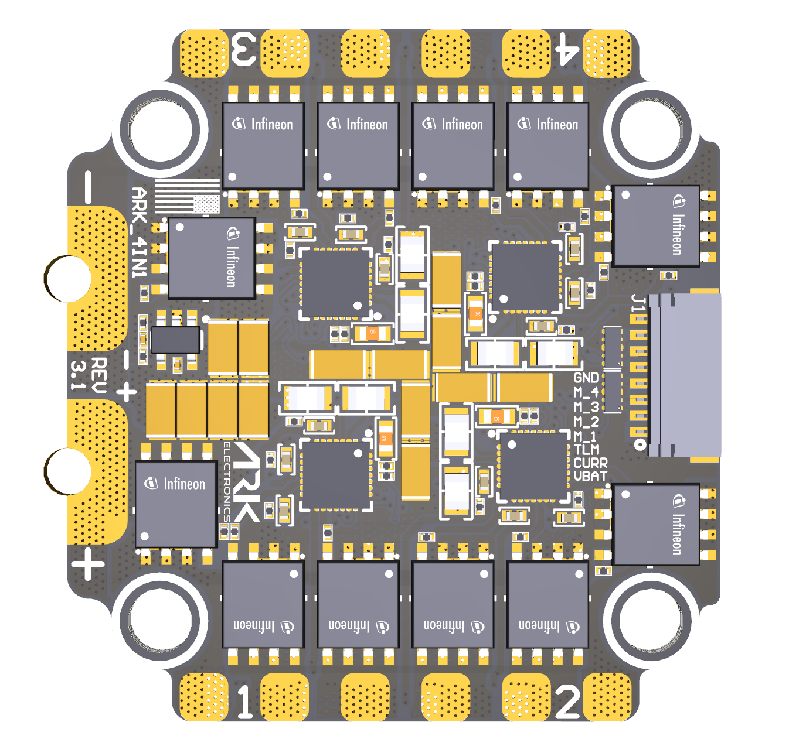
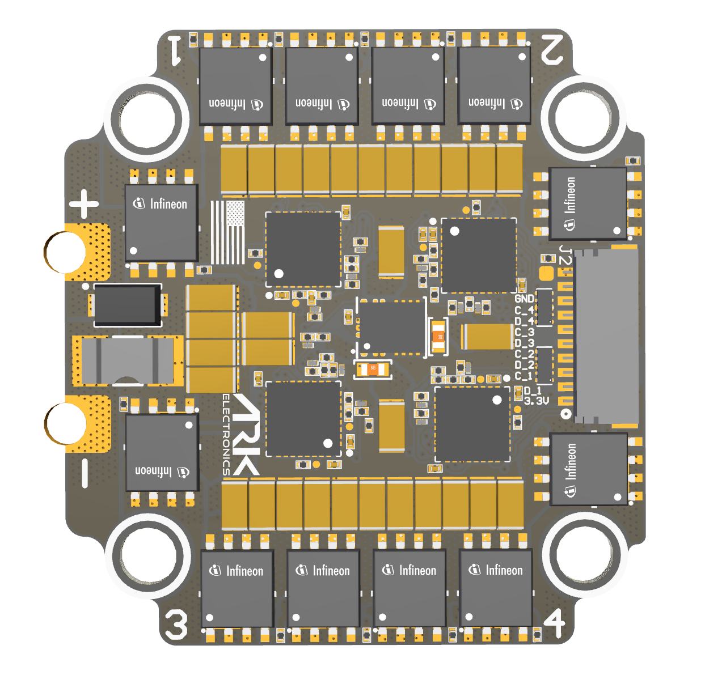

# Hardware Reference

## Specifications

| Specification | Value |
|---------------|-------|
| MCU | 4 × STM32F051, one per motor channel |
| Gate driver | [TI DRV8328](https://www.ti.com/product/DRV8328) |
| Input voltage | 3S–8S LiPo, 6 V minimum, 65 V absolute maximum |
| Current per motor | 50 A continuous, 75 A burst. CONS: MR30 connector limit 30 A continuous, 40 A burst |
| Bulk capacitance | 450 µF, see [Capacitance](#capacitance) |
| Current sensor | Onboard, one shunt shared by all four channels |
| Input protocols | DShot (300, 600) with bidirectional DShot and KISS serial telemetry; PWM |
| Connectors | 8-pin JST-SH flight controller, 10-pin JST-SH debug. CONS: MR30 motor connectors, M2.5 threaded battery standoffs |
| Dimensions | 43.00 × 40.50 × 7.60 mm. CONS: 77.00 × 42.00 × 9.43 mm |
| Mounting pattern | 30.5 mm |
| Weight | 14.5 g. CONS: 24.0 g |

## Pinout

### Flight Controller — 8-pin JST-SH

<figure><figcaption>
Flight Controller Connector
</figcaption></figure>

| Pin | Signal | Voltage |
|-----|--------|---------|
| 1 | VBAT | VBAT |
| 2 | CURR | +3.3V |
| 3 | TELEM | +3.3V |
| 4 | MOTOR 1 | +3.3V |
| 5 | MOTOR 2 | +3.3V |
| 6 | MOTOR 3 | +3.3V |
| 7 | MOTOR 4 | +3.3V |
| 8 | GND | GND |

### Debug — 10-pin JST-SH

<figure><figcaption>
Debug Connector
</figcaption></figure>

| Pin | Signal | Voltage |
|-----|--------|---------|
| 1 | 3.3V | +3.3V |
| 2 | SWDIO 1 | +3.3V |
| 3 | SWDCLK 1 | +3.3V |
| 4 | SWDIO 2 | +3.3V |
| 5 | SWDCLK 2 | +3.3V |
| 6 | SWDIO 3 | +3.3V |
| 7 | SWDCLK 3 | +3.3V |
| 8 | SWDIO 4 | +3.3V |
| 9 | SWDCLK 4 | +3.3V |
| 10 | GND | GND |

Each SWDIO/SWDCLK pair reaches one channel's MCU. See [Flash Bootloader](firmware/flash-bootloader.md) for ST-LINK wiring.

## Capacitance

The ARK 4IN1 ESC has 450µF of bulk capacitance built in, which is sufficient for most 3S–6S installations with short battery leads.


For 8S and above, add an external bulk capacitor across the battery input to keep switching and inrush transients below the 65V absolute maximum. Long battery leads increase inductance and make transients worse at any voltage.


## Datasheets

* [ARK 4IN1 ESC](https://github.com/ARK-Electronics/ark-hardware/blob/main/ARK_4IN1_ESC/datasheet/ARK_4IN1_ESC_Datasheet.pdf)
* [ARK 4IN1 ESC CONS](https://github.com/ARK-Electronics/ark-hardware/blob/main/ARK_4IN1_ESC/datasheet/ARK_4IN1_ESC_CONS_Datasheet.pdf)

## 3D Model and Case

| File | Contents |
|------|----------|
| [ARK\_4\_IN\_1\_ESC\_Rev\_3.1.step](https://github.com/ARK-Electronics/ark-hardware/raw/main/ARK_4IN1_ESC/model/ARK_4_IN_1_ESC_Rev_3.1.step) | ARK 4IN1 ESC board, rev 3.1 |
| [ARK\_4\_IN\_1\_ESC\_Rev\_3.1\_With\_Solder\_Pads.step](https://github.com/ARK-Electronics/ark-hardware/raw/main/ARK_4IN1_ESC/model/ARK_4_IN_1_ESC_Rev_3.1_With_Solder_Pads.step) | ARK 4IN1 ESC board with solder pads, rev 3.1 |
| [ARK\_4\_IN\_1\_ESC\_Rev\_3.1\_PDF3D.pdf](https://github.com/ARK-Electronics/ark-hardware/raw/main/ARK_4IN1_ESC/model/ARK_4_IN_1_ESC_Rev_3.1_PDF3D.pdf) | ARK 4IN1 ESC board, rev 3.1, 3D PDF |
| [ARK\_4\_IN\_1\_ESC\_CON\_Rev\_4.1.step](https://github.com/ARK-Electronics/ark-hardware/raw/main/ARK_4IN1_ESC/model/ARK_4_IN_1_ESC_CON_Rev_4.1.step) | CONS board, rev 4.1 |
| [ARK\_4\_IN\_1\_ESC\_CON\_Rev\_4.1\_With\_Solder\_Pads.step](https://github.com/ARK-Electronics/ark-hardware/raw/main/ARK_4IN1_ESC/model/ARK_4_IN_1_ESC_CON_Rev_4.1_With_Solder_Pads.step) | CONS board with solder pads, rev 4.1 |
| [ARK\_4\_IN\_1\_ESC\_CON\_Straight\_Rev\_4.1\_With\_Solder\_Pads.step](https://github.com/ARK-Electronics/ark-hardware/raw/main/ARK_4IN1_ESC/model/ARK_4_IN_1_ESC_CON_Straight_Rev_4.1_With_Solder_Pads.step) | CONS board, straight variant, with solder pads, rev 4.1 |
| [ARK\_4\_IN\_1\_ESC\_CON\_Rev\_4.1\_PDF3D.pdf](https://github.com/ARK-Electronics/ark-hardware/raw/main/ARK_4IN1_ESC/model/ARK_4_IN_1_ESC_CON_Rev_4.1_PDF3D.pdf) | CONS board, rev 4.1, 3D PDF |

All files: [ARK\_4IN1\_ESC in ark-hardware](https://github.com/ARK-Electronics/ark-hardware/tree/main/ARK_4IN1_ESC)
