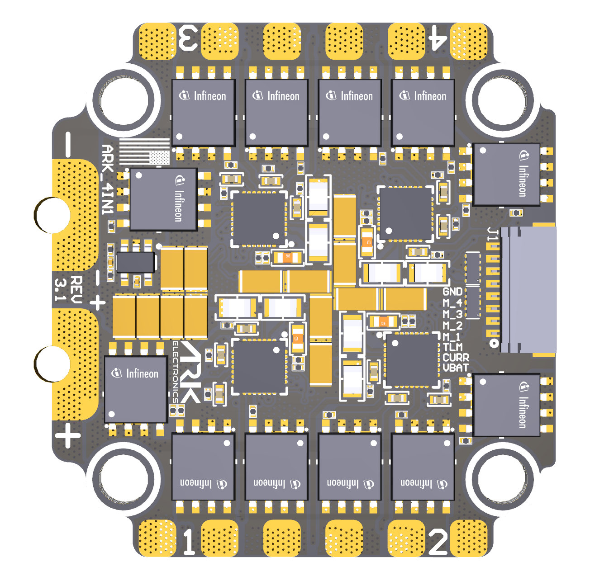
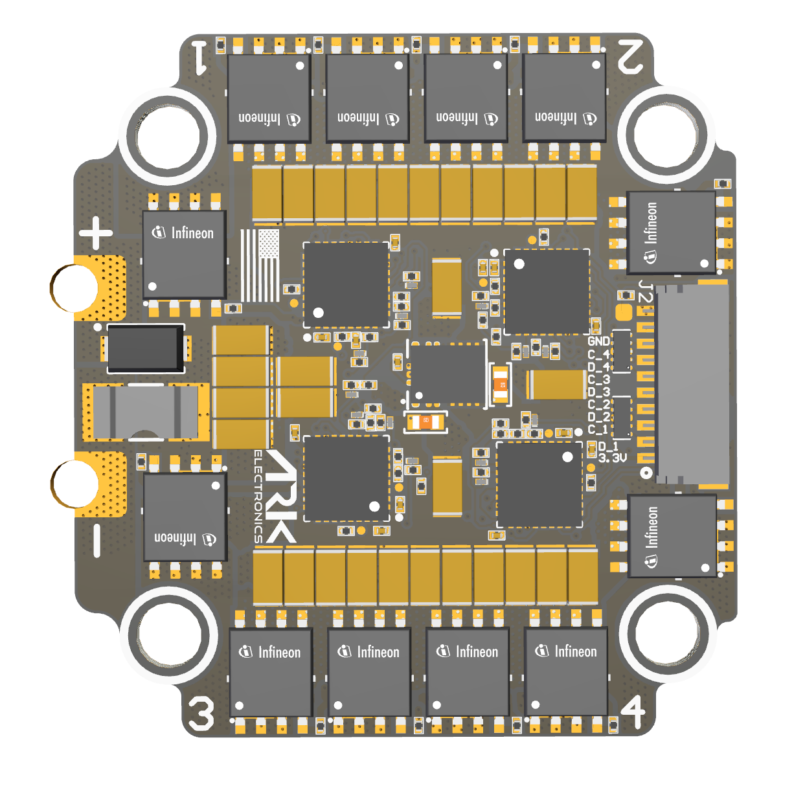

# Pinout

<figure><figcaption>
Flight Controller Connector
</figcaption></figure>

### Flight Controller Connector - 8 Pin JST-SH

<table><thead><tr><th width="157.33333333333331">Pin</th><th>Signal</th><th>Voltage</th></tr></thead><tbody><tr><td>1</td><td>VBAT</td><td>VBAT</td></tr><tr><td>2</td><td>CURR</td><td>+3.3V</td></tr><tr><td>3</td><td>TELEM</td><td>+3.3V</td></tr><tr><td>4</td><td>MOTOR 1</td><td>+3.3V</td></tr><tr><td>5</td><td>MOTOR 2</td><td>+3.3V</td></tr><tr><td>6</td><td>MOTOR 3</td><td>+3.3V</td></tr><tr><td>7</td><td>MOTOR 4</td><td>+3.3V</td></tr><tr><td>8</td><td>GND</td><td>GND</td></tr></tbody></table>

<figure><figcaption>
Debug Connector
</figcaption></figure>

### Debug Connector - 10 Pin JST-SH

<table><thead><tr><th>Pin</th><th width="228.33333333333331">Signal</th><th>Voltage</th></tr></thead><tbody><tr><td>1</td><td>3.3V</td><td>+3.3V</td></tr><tr><td>2</td><td>SWDIO 1</td><td>+3.3V</td></tr><tr><td>3</td><td>SWDCLK 1</td><td>+3.3V</td></tr><tr><td>4</td><td>SWDIO 2</td><td>+3.3V</td></tr><tr><td>5</td><td>SWDCLK 2</td><td>+3.3V</td></tr><tr><td>6</td><td>SWDIO 3</td><td>+3.3V</td></tr><tr><td>7</td><td>SWDCLK 3</td><td>+3.3V</td></tr><tr><td>8</td><td>SWDIO 4</td><td>+3.3V</td></tr><tr><td>9</td><td>SWDCLK 4</td><td>+3.3V</td></tr><tr><td>10</td><td>GND</td><td>GND</td></tr></tbody></table>
