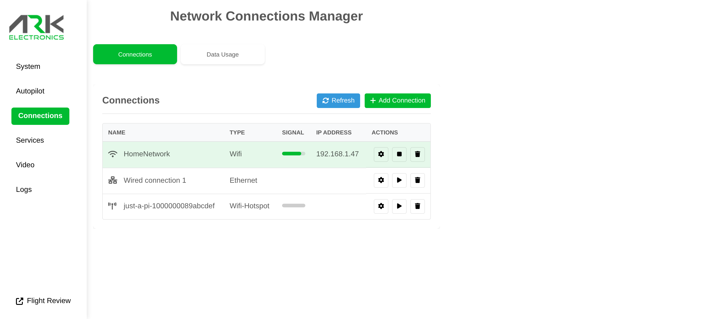

# Getting Started

The ARK Just A Pi is a compact carrier board for the Raspberry Pi Compute Module 5.

## What's Pre-Installed

Bundles that include a CM5 ship pre-imaged and ready to use:

* **OS**: Raspberry Pi OS (64-bit) with the carrier configuration baked in and [ARK-OS](https://github.com/ARK-Electronics/ARK-OS) pre-installed
* **Credentials**: Username `pi`, password `pi`, hostname `just-a-pi`


The default password is well known — change it (`passwd`) before putting the device on a network you don't control.


If you are installing your own Compute Module, follow the [Flashing Guide](flashing-guide/README.md) first.

## Connecting

### Option 1: WiFi Hotspot

On first boot, if no known WiFi network is available, the Pi brings up a hotspot:

* **Network**: `just-a-pi-<serial>`
* **Password**: `password`

Connect to the hotspot, open [http://just-a-pi.local](http://just-a-pi.local), and join your WiFi network from the **Connections** page:

<figure><figcaption><p>ARK-UI Connections page</p></figcaption></figure>

Once the Pi is on your network:

```bash
ssh pi@just-a-pi.local
```

If mDNS is not available on your network, use the Pi's IP address instead.

### Option 2: Ethernet

Plug either external Ethernet port into your network — the Pi requests an address over DHCP.

### Option 3: Serial Debug Console

The **UART0 Debug** connector (6-pin JST-GH) exposes the Compute Module's serial console at 3.3V. Connect a 3.3V USB-to-serial adapter to reach the console before the network is configured. See the [Pinout](pinout.md) for the connector pin assignments.

## ARK-UI Web Interface

ARK-OS hosts a web UI at [http://just-a-pi.local](http://just-a-pi.local) for managing the device: system info, network connections, services, and video streaming. See [ARK-OS](using-ark-os.md).

## Next Steps

* [ARK-OS](using-ark-os.md) – The pre-installed services and web UI
* [Flashing Guide](flashing-guide/README.md) – Image the Compute Module
* [Pinout](pinout.md) – Connector and pin assignments
* [Block Diagram](block-diagram.md) – Board architecture overview
