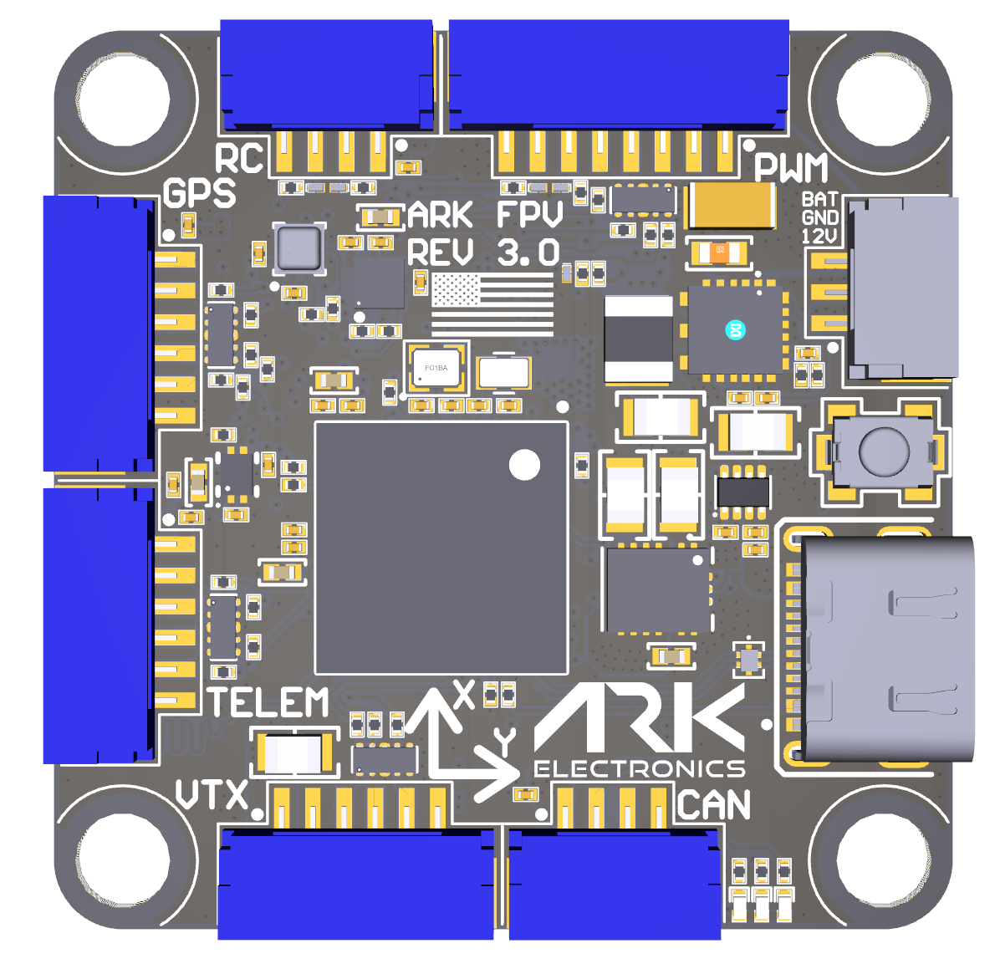
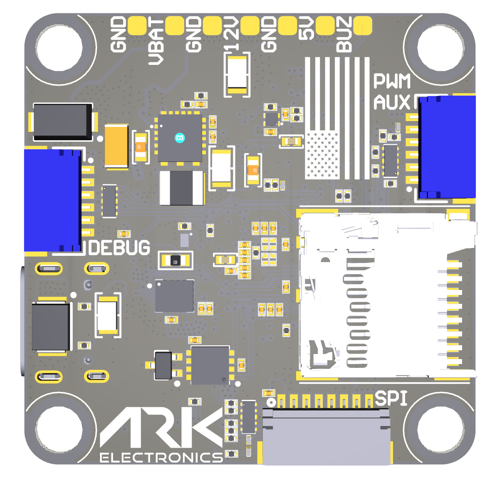

# Hardware Reference

## Specifications

| Specification | Value |
|---------------|-------|
| MCU | [STM32H743IIK6](https://www.st.com/en/microcontrollers-microprocessors/stm32h743ii.html), 480 MHz, 2 MB flash, 1 MB RAM |
| IMU | [Invensense IIM-42653](https://invensense.tdk.com/products/smartindustrial/iim-42653/) industrial IMU |
| Barometer | [Bosch BMP390](https://www.bosch-sensortec.com/products/environmental-sensors/pressure-sensors/pressure-sensors-bmp390.html) |
| Magnetometer | [ST IIS2MDC](https://www.st.com/en/mems-and-sensors/iis2mdc.html) |
| Heater | 1 W, for warming sensors in extreme cold |
| Storage | MicroSD slot |
| Indicators | LEDs |
| Interfaces | USB-C (VBUS in, USB), 9 PWM outputs, CAN, GPS (UART, I2C), TELEM (UART with flow control), RC (UART), VTX (12 V, two UARTs), SPI for an OSD or external IMU, debug (UART, SWD) |
| Battery input | 5.5–54 V (3S–12S). Zener diode, 54 V standoff, 60 V breakdown |
| 5 V regulator | 2 A |
| Power draw | 500 mA: 300 mA main system, 200 mA heater |
| 12 V regulator | 2 A, for video transmitters and payloads. Tracks VBAT when VBAT is below 12 V. Power control from the MCU (pit switch) |
| Voltage monitoring | VBAT in, 5.0 V, 12.0 V, 3.3 V FMU, 3.3 V sensors |
| Mounting | 30.5 mm |
| Dimensions | 3.6 × 3.6 × 0.8 cm |
| Weight | 7.5 g with MicroSD card |

## Pinout

<figure><figcaption>
ARK FPV Flight Controller Top
</figcaption></figure>

<figure><figcaption>
ARK FPV Flight Controller Bottom
</figcaption></figure>

### PWM UART4 — 8-pin JST-GH

| Pin | Signal | Voltage |
|-----|--------|---------|
| 1 | VBAT IN | 5.5V-54V |
| 2 | CURR_IN_EXT | 3.3V |
| 3 | UART4_RX_EXT | 3.3V |
| 4 | FMU_CH1_EXT | 3.3V |
| 5 | FMU_CH2_EXT | 3.3V |
| 6 | FMU_CH3_EXT | 3.3V |
| 7 | FMU_CH4_EXT | 3.3V |
| 8 | GND | GND |

### RC — 4-pin JST-GH

| Pin | Signal | Voltage |
|-----|--------|---------|
| 1 | 5.0V | 5.0V |
| 2 | USART6_RX_IN_EXT | 3.3V |
| 3 | USART6_TX_OUTPUT_EXT | 3.3V |
| 4 | GND | GND |

### PWM EXTRA — 6-pin JST-SH

| Pin | Signal | Voltage |
|-----|--------|---------|
| 1 | FMU_CH5_EXT | 3.3V |
| 2 | FMU_CH6_EXT | 3.3V |
| 3 | FMU_CH7_EXT | 3.3V |
| 4 | FMU_CH8_EXT | 3.3V |
| 5 | FMU_CH9_EXT | 3.3V |
| 6 | GND | GND |

### POWER AUX — 3-pin JST-GH

| Pin | Signal | Voltage |
|-----|--------|---------|
| 1 | 12.0V | 12.0V |
| 2 | GND | GND |
| 3 | VBAT IN/OUT | 5.5V-54V |

### CAN — 4-pin JST-GH

| Pin | Signal | Voltage |
|-----|--------|---------|
| 1 | 5.0V | 5.0V |
| 2 | CAN1_P | 5.0V |
| 3 | CAN1_N | 5.0V |
| 4 | GND | GND |

### GPS — 6-pin JST-GH

| Pin | Signal | Voltage |
|-----|--------|---------|
| 1 | 5.0V | 5.0V |
| 2 | USART1_TX_GPS1_EXT | 3.3V |
| 3 | USART1_RX_GPS1_EXT | 3.3V |
| 4 | I2C1_SCL_GPS1_EXT | 3.3V |
| 5 | I2C1_SDA_GPS1_EXT | 3.3V |
| 6 | GND | GND |

### TELEM — 6-pin JST-GH

| Pin | Signal | Voltage |
|-----|--------|---------|
| 1 | 5.0V | 5.0V |
| 2 | UART7_TX_TELEM1_EXT | 3.3V |
| 3 | UART7_RX_TELEM1_EXT | 3.3V |
| 4 | UART7_CTS_TELEM1_EXT | 3.3V |
| 5 | UART7_RTS_TELEM1_EXT | 3.3V |
| 6 | GND | GND |

### VTX — 6-pin JST-GH

| Pin | Signal | Voltage |
|-----|--------|---------|
| 1 | 12.0V | 12.0V |
| 2 | GND | GND |
| 3 | UART5_TX_TELEM2_EXT | 3.3V |
| 4 | UART5_RX_TELEM2_EXT | 3.3V |
| 5 | USART2_RX_TELEM3_EXT | 3.3V |
| 6 | GND | GND |

### SPI (OSD or IMU) — 8-pin JST-SH

| Pin | Signal | Voltage |
|-----|--------|---------|
| 1 | 5.0V | 5.0V |
| 2 | SPI6_SCK_EXT | 3.3V |
| 3 | SPI6_MISO_EXT | 3.3V |
| 4 | SPI6_MOSI_EXT | 3.3V |
| 5 | SPI6_nCS1_EXT | 3.3V |
| 6 | SPI6_DRDY1_EXT | 3.3V |
| 7 | SPI6_nRESET_EXT | 3.3V |
| 8 | GND | GND |

### Flight Controller Debug — 6-pin JST-SH

| Pin | Signal | Voltage |
|-----|--------|---------|
| 1 | 3V3_FMU | 3.3V |
| 2 | USART3_TX_DEBUG | 3.3V |
| 3 | USART3_RX_DEBUG | 3.3V |
| 4 | FMU_SWDIO | 3.3V |
| 5 | FMU_SWCLK | 3.3V |
| 6 | GND | GND |

## UART Port Mapping

| UART | Connector | PX4 name | NuttX tty |
|------|-----------|----------|-----------|
| USART1 | GPS | GPS1 | /dev/ttyS0 |
| USART2 | VTX | Telem3 | /dev/ttyS1 |
| USART3 | Debug | Debug | /dev/ttyS2 |
| UART4 | PWM | UART4 | /dev/ttyS3 |
| UART5 | VTX | Telem2 | /dev/ttyS4 |
| USART6 | RC | USART6 | /dev/ttyS5 |
| UART7 | Telem | Telem1 | /dev/ttyS6 |

## 3D Model and Case

| File | Contents |
|------|----------|
| [ARK\_FPV\_Rev\_1.0.step](https://github.com/ARK-Electronics/ark-hardware/raw/main/ARK_FPV/model/ARK_FPV_Rev_1.0.step) | Board, rev 1.0 |
| [ARK\_FPV\_Rev\_1.0\_PDF3D.pdf](https://github.com/ARK-Electronics/ark-hardware/raw/main/ARK_FPV/model/ARK_FPV_Rev_1.0_PDF3D.pdf) | Board, rev 1.0, 3D PDF |
| [Top\_ARK\_FPV\_Case\_rev1.stl](https://github.com/ARK-Electronics/ark-hardware/raw/main/ARK_FPV/case/Top_ARK_FPV_Case_rev1.stl) | Case top |
| [Bottom\_ARK\_FPV\_Case\_rev1.stl](https://github.com/ARK-Electronics/ark-hardware/raw/main/ARK_FPV/case/Bottom_ARK_FPV_Case_rev1.stl) | Case bottom |

All files: [ARK\_FPV in ark-hardware](https://github.com/ARK-Electronics/ark-hardware/tree/main/ARK_FPV)
