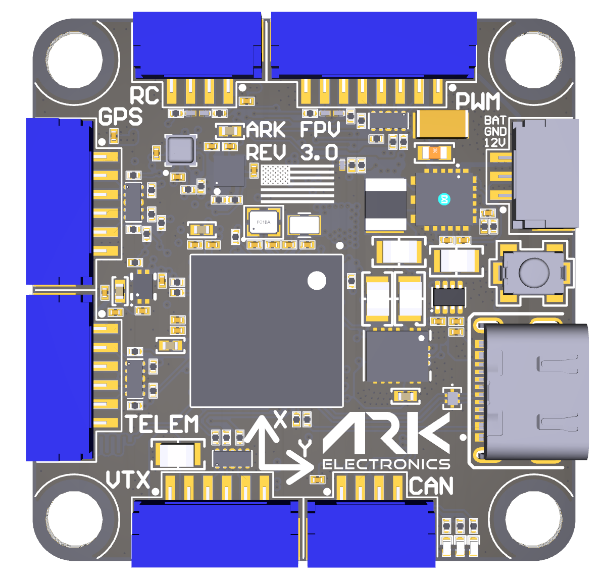
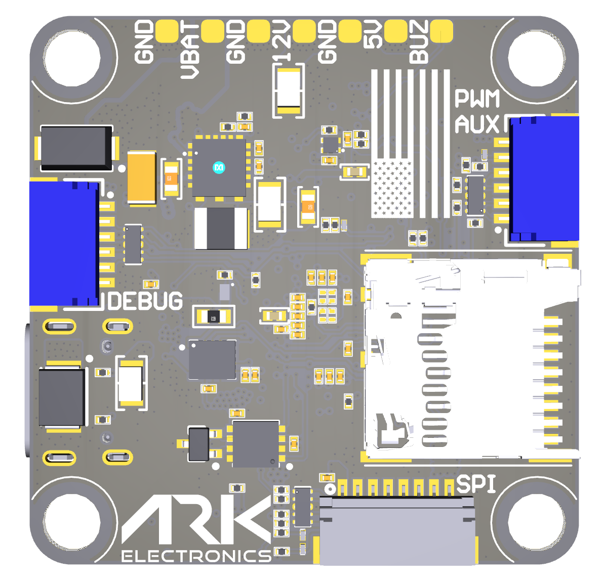

# Pinout

<figure><figcaption>
ARK FPV Flight Controller Top
</figcaption></figure>

<figure><figcaption>
ARK FPV Flight Controller Bottom
</figcaption></figure>

#### UART Port Mapping

<table><thead><tr><th>UART</th><th width="187">Connector</th><th>PX4 name</th><th>Nuttx tty</th></tr></thead><tbody><tr><td>USART1</td><td>GPS</td><td>GPS1</td><td>/dev/ttyS0</td></tr><tr><td>USART2</td><td>VTX</td><td>Telem3</td><td>/dev/ttyS1</td></tr><tr><td>USART3</td><td>Debug</td><td>Debug</td><td>/dev/ttyS2</td></tr><tr><td>UART4</td><td>PWM</td><td>UART4</td><td>/dev/ttyS3</td></tr><tr><td>UART5</td><td>VTX</td><td>Telem2</td><td>/dev/ttyS4</td></tr><tr><td>USART6</td><td>RC</td><td>USART6</td><td>/dev/ttyS5</td></tr><tr><td>UART7</td><td>Telem</td><td>Telem1</td><td>/dev/ttyS6</td></tr></tbody></table>

#### PWM UART4 - 8 Pin JST-GH

<table><thead><tr><th width="153">Pin Number</th><th width="210">Signal Name</th><th>Voltage</th></tr></thead><tbody><tr><td>1</td><td>VBAT IN</td><td>5.5V-54V</td></tr><tr><td>2</td><td>CURR_IN_EXT</td><td>3.3V</td></tr><tr><td>3</td><td>UART4_RX_EXT</td><td>3.3V</td></tr><tr><td>4</td><td>FMU_CH1_EXT</td><td>3.3V</td></tr><tr><td>5</td><td>FMU_CH2_EXT</td><td>3.3V</td></tr><tr><td>6</td><td>FMU_CH3_EXT</td><td>3.3V</td></tr><tr><td>7</td><td>FMU_CH4_EXT</td><td>3.3V</td></tr><tr><td>8</td><td>GND</td><td>GND</td></tr></tbody></table>

#### RC - 4 Pin JST-GH

<table><thead><tr><th width="134">Pin Number</th><th width="237">Signal Name</th><th>Voltage</th></tr></thead><tbody><tr><td>1</td><td>5.0V</td><td>5.0V</td></tr><tr><td>2</td><td>USART6_RX_IN_EXT</td><td>3.3V</td></tr><tr><td>3</td><td>USART6_TX_OUTPUT_EXT</td><td>3.3V</td></tr><tr><td>4</td><td>GND</td><td>GND</td></tr></tbody></table>

#### PWM EXTRA - 6 Pin JST-SH

<table><thead><tr><th width="134">Pin Number</th><th width="237">Signal Name</th><th>Voltage</th></tr></thead><tbody><tr><td>1</td><td>FMU_CH5_EXT</td><td>3.3V</td></tr><tr><td>2</td><td>FMU_CH6_EXT</td><td>3.3V</td></tr><tr><td>3</td><td>FMU_CH7_EXT</td><td>3.3V</td></tr><tr><td>4</td><td>FMU_CH8_EXT</td><td>3.3V</td></tr><tr><td>5</td><td>FMU_CH9_EXT</td><td>3.3V</td></tr><tr><td>6</td><td>GND</td><td>GND</td></tr></tbody></table>

#### POWER AUX - 3 Pin JST-GH

<table><thead><tr><th width="134">Pin Number</th><th width="237">Signal Name</th><th>Voltage</th></tr></thead><tbody><tr><td>1</td><td>12.0V</td><td>12.0V</td></tr><tr><td>2</td><td>GND</td><td>GND</td></tr><tr><td>3</td><td>VBAT IN/OUT</td><td>5.5V-54V</td></tr></tbody></table>

#### CAN - 4 Pin JST-GH

<table><thead><tr><th width="134">Pin Number</th><th width="237">Signal Name</th><th>Voltage</th></tr></thead><tbody><tr><td>1</td><td>5.0V</td><td>5.0V</td></tr><tr><td>2</td><td>CAN1_P</td><td>5.0V</td></tr><tr><td>3</td><td>CAN1_N</td><td>5.0V</td></tr><tr><td>4</td><td>GND</td><td>GND</td></tr></tbody></table>

#### GPS - 6 Pin JST-GH

<table><thead><tr><th width="134">Pin Number</th><th width="237">Signal Name</th><th>Voltage</th></tr></thead><tbody><tr><td>1</td><td>5.0V</td><td>5.0V</td></tr><tr><td>2</td><td>USART1_TX_GPS1_EXT</td><td>3.3V</td></tr><tr><td>3</td><td>USART1_RX_GPS1_EXT</td><td>3.3V</td></tr><tr><td>4</td><td>I2C1_SCL_GPS1_EXT</td><td>3.3V</td></tr><tr><td>5</td><td>I2C1_SDA_GPS1_EXT</td><td>3.3V</td></tr><tr><td>6</td><td>GND</td><td>GND</td></tr></tbody></table>

#### TELEM - 6 Pin JST-GH

<table><thead><tr><th width="134">Pin Number</th><th width="237">Signal Name</th><th>Voltage</th></tr></thead><tbody><tr><td>1</td><td>5.0V</td><td>5.0V</td></tr><tr><td>2</td><td>UART7_TX_TELEM1_EXT</td><td>3.3V</td></tr><tr><td>3</td><td>UART7_RX_TELEM1_EXT</td><td>3.3V</td></tr><tr><td>4</td><td>UART7_CTS_TELEM1_EXT</td><td>3.3V</td></tr><tr><td>5</td><td>UART7_RTS_TELEM1_EXT</td><td>3.3V</td></tr><tr><td>6</td><td>GND</td><td>GND</td></tr></tbody></table>

#### VTX - 6 Pin JST-GH

<table><thead><tr><th width="134">Pin Number</th><th width="237">Signal Name</th><th>Voltage</th></tr></thead><tbody><tr><td>1</td><td>12.0V</td><td>12.0V</td></tr><tr><td>2</td><td>GND</td><td>GND</td></tr><tr><td>3</td><td>UART5_TX_TELEM2_EXT</td><td>3.3V</td></tr><tr><td>4</td><td>UART5_RX_TELEM2_EXT</td><td>3.3V</td></tr><tr><td>5</td><td>USART2_RX_TELEM3_EXT</td><td>3.3V</td></tr><tr><td>6</td><td>GND</td><td>GND</td></tr></tbody></table>

#### SPI (OSD or IMU) - 8 Pin JST-SH

<table><thead><tr><th width="153">Pin Number</th><th width="210">Signal Name</th><th>Voltage</th></tr></thead><tbody><tr><td>1</td><td>5.0V</td><td>5.0V</td></tr><tr><td>2</td><td>SPI6_SCK_EXT</td><td>3.3V</td></tr><tr><td>3</td><td>SPI6_MISO_EXT</td><td>3.3V</td></tr><tr><td>4</td><td>SPI6_MOSI_EXT</td><td>3.3V</td></tr><tr><td>5</td><td>SPI6_nCS1_EXT</td><td>3.3V</td></tr><tr><td>6</td><td>SPI6_DRDY1_EXT</td><td>3.3V</td></tr><tr><td>7</td><td>SPI6_nRESET_EXT</td><td>3.3V</td></tr><tr><td>8</td><td>GND</td><td>GND</td></tr></tbody></table>

#### Flight Controller Debug - 6 Pin JST-SH

<table><thead><tr><th width="153">Pin Number</th><th width="210">Signal Name</th><th>Voltage</th></tr></thead><tbody><tr><td>1</td><td>3V3_FMU</td><td>3.3V</td></tr><tr><td>2</td><td>USART3_TX_DEBUG</td><td>3.3V</td></tr><tr><td>3</td><td>USART3_RX_DEBUG</td><td>3.3V</td></tr><tr><td>4</td><td>FMU_SWDIO</td><td>3.3V</td></tr><tr><td>5</td><td>FMU_SWCLK</td><td>3.3V</td></tr><tr><td>6</td><td>GND</td><td>GND</td></tr></tbody></table>
