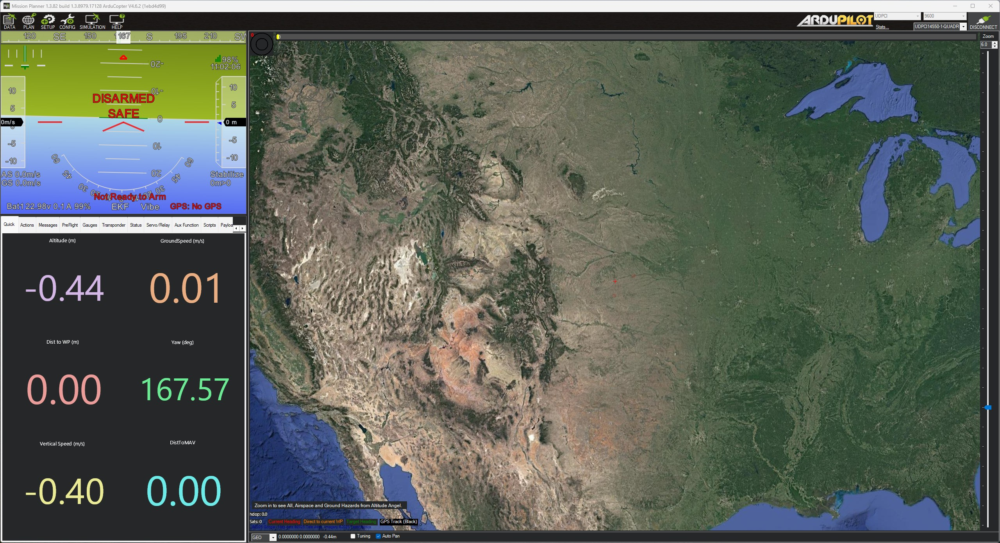

# MissionPlanner ArduPilot Connection

When using ArduPilot on the ARKV6X, to connect to MissionPlanner, use UDPCI as the connection type. Enter the IP address of the Jetson with port 14550.&#x20;

<figure><figcaption></figcaption></figure>

<figure><figcaption></figcaption></figure>

<figure><figcaption></figcaption></figure>

<figure><figcaption></figcaption></figure>
