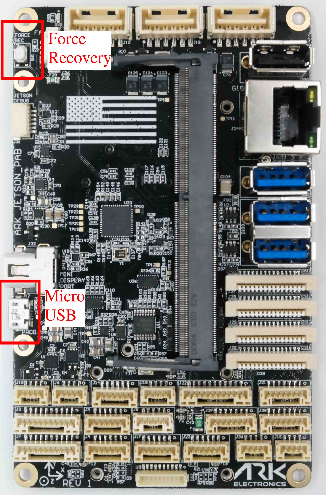

# Flashing Guide

If you purchased a bundle the [Jetpack Ubuntu OS](https://developer.nvidia.com/embedded/jetpack) is already installed along with [ARK-OS](https://github.com/ARK-Electronics/ARK-OS). Follow this guide if you want to update to the latest Jetpack or need to flash your Jetson for the first time.

## ARK Jetson Kernel GitHub Repository

This repository contains helper scripts to download and build the kernel. Please follow the README.\
[https://github.com/ARK-Electronics/ark\_jetson\_kernel](https://github.com/ARK-Electronics/ark_jetson_kernel)

## Overview

To flash the kernel you will need to connect the Jetson to your Host PC using the **Micro USB** connection. You must boot the jetson while holding the **Force Recovery** button.\

