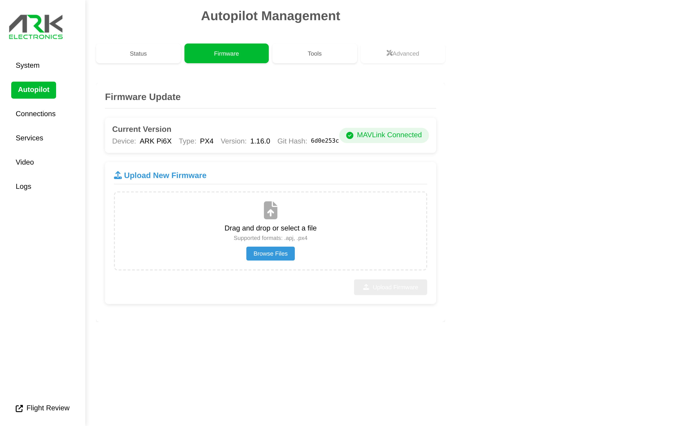

# Updating the Flight Controller Firmware

## From the Web UI

Open the [ARK-UI](http://pi6x.local) **Autopilot** page, select the **Firmware** tab, and upload a `.px4` firmware file.

<figure><figcaption></figcaption></figure>

## From the Command Line

SSH into the Pi and run the ARK-OS flashing tool (on `PATH`). The update is performed over the USB connection:

```bash
flash_firmware.sh <firmware.px4>
```

## Firmware Binaries

Download the latest `ark_pi6x_default.px4` from the [PX4 releases page](https://github.com/PX4/PX4-Autopilot/releases/).
