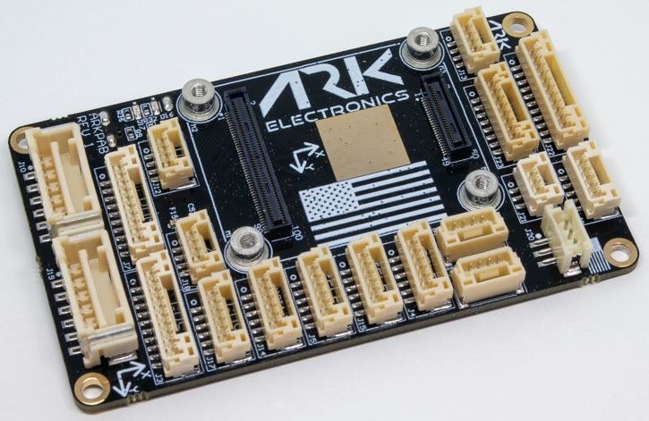

# ARK Pixhawk Autopilot Bus Carrier

The ARK Pixhawk Autopilot Bus (PAB) Carrier is a USA-built flight controller carrier board, based on the [Pixhawk Autopilot Bus open source standard](https://github.com/pixhawk/Pixhawk-Standards).

The PAB form factor enables the ARK PAB Carrier to be used with any [PAB-compatible flight controller](https://docs.px4.io/main/en/flight_controller/pixhawk_autopilot_bus.html), such as the [ARKV6X](https://docs.px4.io/main/en/flight_controller/arkv6x.html).

<figure><figcaption>
ARK Pixhawk Autopilot Bus Carrier
</figcaption></figure>

### Features 

* [Pixhawk Autopilot Bus (PAB) Form Factor](https://github.com/pixhawk/Pixhawk-Standards/blob/master/DS-010%20Pixhawk%20Autopilot%20Bus%20Standard.pdf?_ga=2.20605755.2081055420.1671562222-391294592.1671562222)
* USA Built

### Connectors 

* PAB Board to Board Interface
  * 100 Pin Hirose DF40
  * 40 Pin Hirose DF40
* Dual Digital Power Module Inputs
  * 5V Input
  * I2C Power Monitor
  * 6 Pin Molex CLIK-Mate
* Ethernet
  * 100Mbps
  * Built in Magnetics
  * 4 Pin JST-GH
* Full GPS Plus Safety Switch Port
  * 10 Pin JST-GH
* Basic GPS Port
  * 6 Pin JST-GH
* Dual CAN Ports
  * 4 Pin JST-GH
* Triple Telemetry Ports with Flow - Control
  * 6 Pin JST-GH
* Eight PWM Outputs
  * 10 Pin JST-GH
* UART/I2C Port
  * 6 Pin JST-GH
* I2C Port
  * 4 Pin JST-GH
* PPM RC Port
  * 3 Pin JST-GH
* DSM RC Port
  * 3 Pin JST-ZH
* SPI Port
  * 11 Pin JST-GH
* ADIO Port
  * 8 Pin JST-GH
* Debug Port
  * 10 Pin JST-SH

### Dimensions 

* Without Flight Controller Module
  * 74.0mm x 43.5mm x 12.0mm
  * 22g

### Power 

* 5V input on `POWER1`, `POWER2`, `USB C`, and the `USB JST-GH` connector
  * Input is prioritized in the following order: POWER1 > POWER2 > USB
  * `USB C` and the `USB JST-GH` are in parallel
  * Overvoltage protection at 5.8V
  * Undervoltage protection at 3.9V
* `VDD_5V_HIPOWER` and `VDD_5V_PERIPH` can each provide a total of 1.5A across all the connectors

### LEDS 

* There are two LEDs on the ARK PAB
  * `Red` is the ethernet power LED
  * `Green` is the ethernet activity LED

### Pinout 

### POWER1 

| Pin     | Signal    | Volt  |
| ------- | --------- | ----- |
| 1 (red) | `VBRICK1` | +5.0V |
| 2 (blk) | `VBRICK1` | +5.0V |
| 3 (blk) | I2C1\_SCL | +3.3V |
| 4 (blk) | I2C1\_SDA | +3.3V |
| 5 (blk) | `GND`     | GND   |
| 6 (blk) | `GND`     | GND   |

### POWER2 

| Pin     | Signal    | Volt  |
| ------- | --------- | ----- |
| 1 (red) | `VBRICK2` | +5.0V |
| 2 (blk) | `VBRICK2` | +5.0V |
| 3 (blk) | I2C2\_SCL | +3.3V |
| 4 (blk) | I2C2\_SDA | +3.3V |
| 5 (blk) | `GND`     | GND   |
| 6 (blk) | `GND`     | GND   |

### PWM 

| Pin      | Signal                     | Volt  |
| -------- | -------------------------- | ----- |
| 1 (red)  | VDD\_SERVO (Not Connected) | +5.0V |
| 2 (blk)  | FMU\_CH1                   | +3.3V |
| 3 (blk)  | FMU\_CH2                   | +3.3V |
| 4 (blk)  | FMU\_CH3                   | +3.3V |
| 5 (blk)  | FMU\_CH4                   | +3.3V |
| 6 (blk)  | FMU\_CH5                   | +3.3V |
| 7 (blk)  | FMU\_CH6                   | +3.3V |
| 8 (blk)  | FMU\_CH7                   | +3.3V |
| 9 (blk)  | FMU\_CH8                   | +3.3V |
| 10 (blk) | `GND`                      | GND   |

### GPS1 

| Pin      | Signal                    | Volt  |
| -------- | ------------------------- | ----- |
| 1 (red)  | `VDD_5V_PERIPH`           | +5.0V |
| 2 (blk)  | USART1\_TX\_GPS1          | +3.3V |
| 3 (blk)  | USART1\_RX\_GPS1          | +3.3V |
| 4 (blk)  | I2C1\_SCL                 | +3.3V |
| 5 (blk)  | I2C1\_SDA                 | +3.3V |
| 6 (blk)  | nSAFETY\_SWITCH\_IN       | +3.3V |
| 7 (blk)  | nSAFETY\_SWITCH\_LED\_OUT | +3.3V |
| 8 (blk)  | `3V3_FMU`                 | +3.3V |
| 9 (blk)  | BUZZER                    | +5.0V |
| 10 (blk) | `GND`                     | GND   |

### GPS2 

| Pin     | Signal           | Volt  |
| ------- | ---------------- | ----- |
| 1 (red) | `VDD_5V_HIPOWER` | +5.0V |
| 2 (blk) | UART8\_TX\_GPS2  | +3.3V |
| 3 (blk) | UART8\_RX\_GPS2  | +3.3V |
| 4 (blk) | I2C2\_SCL        | +3.3V |
| 5 (blk) | I2C2\_SDA        | +3.3V |
| 6 (blk) | `GND`            | GND   |

### TELEM1 

| Pin     | Signal           | Volt  |
| ------- | ---------------- | ----- |
| 1 (red) | `VDD_5V_HIPOWER` | +5.0V |
| 2 (blk) | UART7\_TX        | +3.3V |
| 3 (blk) | UART7\_RX        | +3.3V |
| 4 (blk) | UART7\_CTS       | +3.3V |
| 5 (blk) | UART7\_RTS       | +3.3V |
| 6 (blk) | `GND`            | GND   |

### TELEM2 

| Pin     | Signal          | Volt  |
| ------- | --------------- | ----- |
| 1 (red) | `VDD_5V_PERIPH` | +5.0V |
| 2 (blk) | UART5\_TX       | +3.3V |
| 3 (blk) | UART5\_RX       | +3.3V |
| 4 (blk) | UART5\_CTS      | +3.3V |
| 5 (blk) | UART5\_RTS      | +3.3V |
| 6 (blk) | `GND`           | GND   |

### TELEM3 

| Pin     | Signal           | Volt  |
| ------- | ---------------- | ----- |
| 1 (red) | `VDD_5V_HIPOWER` | +5.0V |
| 2 (blk) | USART2\_TX       | +3.3V |
| 3 (blk) | USART2\_RX       | +3.3V |
| 4 (blk) | USART2\_CTS      | +3.3V |
| 5 (blk) | USART2\_RTS      | +3.3V |
| 6 (blk) | `GND`            | GND   |

### UART4/I2C3 

| Pin     | Signal          | Volt  |
| ------- | --------------- | ----- |
| 1 (red) | `VDD_5V_PERIPH` | +5.0V |
| 2 (blk) | UART4\_TX       | +3.3V |
| 3 (blk) | UART4\_RX       | +3.3V |
| 4 (blk) | I2C3\_SCL       | +3.3V |
| 5 (blk) | I2C3\_SDA       | +3.3V |
| 6 (blk) | `GND`           | GND   |

### I2C3 

| Pin     | Signal          | Volt  |
| ------- | --------------- | ----- |
| 1 (red) | `VDD_5V_PERIPH` | +5.0V |
| 2 (blk) | I2C3\_SCL       | +3.3V |
| 3 (blk) | I2C3\_SDA       | +3.3V |
| 4 (blk) | `GND`           | GND   |

### CAN1 

| Pin     | Signal           | Volt  |
| ------- | ---------------- | ----- |
| 1 (red) | `VDD_5V_HIPOWER` | +5.0V |
| 2 (blk) | CAN1\_H          | +3.3V |
| 3 (blk) | CAN1\_L          | +3.3V |
| 4 (blk) | `GND`            | GND   |

### CAN2 

| Pin     | Signal          | Volt  |
| ------- | --------------- | ----- |
| 1 (red) | `VDD_5V_PERIPH` | +5.0V |
| 2 (blk) | CAN2\_H         | +3.3V |
| 3 (blk) | CAN2\_L         | +3.3V |
| 4 (blk) | `GND`           | GND   |

### USB 

All signals in parallel with USB C connector

| Pin     | Signal    | Volt  |
| ------- | --------- | ----- |
| 1 (red) | `VBUS_IN` | +5.0V |
| 2 (blk) | USB\_N    | +3.3V |
| 3 (blk) | USB\_P    | +3.3V |
| 4 (blk) | `GND`     | GND   |

### ETH 

| Pin     | Signal     | Volt            |
| ------- | ---------- | --------------- |
| 1 (red) | ETH\_RD\_N | +50.0V Tolerant |
| 2 (blk) | ETH\_RD\_P | +50.0V Tolerant |
| 3 (blk) | ETH\_TD\_N | +50.0V Tolerant |
| 4 (blk) | ETH\_TD\_P | +50.0V Tolerant |

### ADIO 

| Pin     | Signal          | Volt  |
| ------- | --------------- | ----- |
| 1 (red) | `VDD_5V_PERIPH` | +5.0V |
| 2 (blk) | FMU\_CAP        | +3.3V |
| 3 (blk) | BOOTLOADER      | +3.3V |
| 4 (blk) | FMU\_RST\_REQ   | +3.3V |
| 5 (blk) | nARMED          | +3.3V |
| 6 (blk) | ADC1\_3V3       | +3.3V |
| 7 (blk) | ADC1\_6V6       | +3.3V |
| 8 (blk) | `GND`           | GND   |

### RC/SBUS 

| Pin     | Signal               | Volt  |
| ------- | -------------------- | ----- |
| 1 (red) | `VDD_5V_SBUS_RC`     | +5.0V |
| 2 (blk) | USART6\_RX\_SBUS\_IN | +3.3V |
| 3 (blk) | USART6\_TX           | +3.3V |
| 4 (blk) | `VDD_3V3_SPEKTRUM`   | +3.3V |
| 5 (blk) | `GND`                | GND   |

### PPM 

| Pin     | Signal                     | Volt  |
| ------- | -------------------------- | ----- |
| 1 (red) | `VDD_5V_PPM_RC`            | +5.0V |
| 2 (blk) | DSM\_INPUT/FMU\_PPM\_INPUT | +3.3V |
| 3 (blk) | `GND`                      | GND   |

### DSM 

| Pin     | Signal                     | Volt  |
| ------- | -------------------------- | ----- |
| 1 (red) | `VDD_3V3_SPEKTRUM`         | +3.3V |
| 2 (blk) | `GND`                      | GND   |
| 3 (blk) | DSM\_INPUT/FMU\_PPM\_INPUT | +3.3V |

### SPI6 

| Pin      | Signal          | Volt  |
| -------- | --------------- | ----- |
| 1 (red)  | `VDD_5V_PERIPH` | +5.0V |
| 2 (blk)  | SPI6\_SCK       | +3.3V |
| 3 (blk)  | SPI6\_MISO      | +3.3V |
| 4 (blk)  | SPI6\_MOSI      | +3.3V |
| 5 (blk)  | SPI6\_nCS1      | +3.3V |
| 6 (blk)  | SPI6\_nCS2      | +3.3V |
| 7 (blk)  | SPIX\_nSYNC     | +3.3V |
| 8 (blk)  | SPI6\_DRDY1     | +3.3V |
| 9 (blk)  | SPI6\_DRDY2     | +3.3V |
| 10 (blk) | SPI6\_nRESET    | +3.3V |
| 11 (blk) | `GND`           | GND   |
