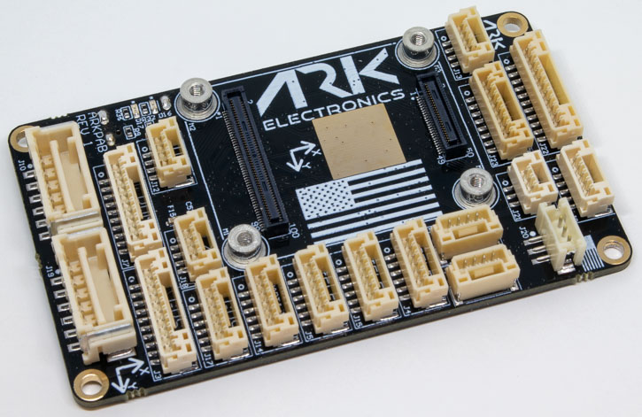

# ARK Pixhawk Autopilot Bus Carrier

The ARK Pixhawk Autopilot Bus (PAB) Carrier is a USA-built flight controller carrier board, based on the [Pixhawk Autopilot Bus open source standard](https://github.com/pixhawk/Pixhawk-Standards).

The PAB form factor enables the ARK PAB Carrier to be used with any [PAB-compatible flight controller](https://docs.px4.io/main/en/flight_controller/pixhawk_autopilot_bus.html), such as the [ARKV6X](https://docs.px4.io/main/en/flight_controller/arkv6x.html).

<figure><figcaption>
ARK Pixhawk Autopilot Bus Carrier
</figcaption></figure>

### Features 

* [Pixhawk Autopilot Bus (PAB) Form Factor](https://github.com/pixhawk/Pixhawk-Standards/blob/master/DS-010%20Pixhawk%20Autopilot%20Bus%20Standard.pdf?_ga=2.20605755.2081055420.1671562222-391294592.1671562222)
* USA Built

### Connectors 

* PAB Board to Board Interface
  * 100 Pin Hirose DF40
  * 40 Pin Hirose DF40
* Dual Digital Power Module Inputs
  * 5V Input
  * I2C Power Monitor
  * 6 Pin Molex CLIK-Mate
* Ethernet
  * 100Mbps
  * Built in Magnetics
  * 4 Pin JST-GH
* Full GPS Plus Safety Switch Port
  * 10 Pin JST-GH
* Basic GPS Port
  * 6 Pin JST-GH
* Dual CAN Ports
  * 4 Pin JST-GH
* Triple Telemetry Ports with Flow - Control
  * 6 Pin JST-GH
* Eight PWM Outputs
  * 10 Pin JST-GH
* UART/I2C Port
  * 6 Pin JST-GH
* I2C Port
  * 4 Pin JST-GH
* PPM RC Port
  * 3 Pin JST-GH
* DSM RC Port
  * 3 Pin JST-ZH
* SPI Port
  * 11 Pin JST-GH
* ADIO Port
  * 8 Pin JST-GH
* Debug Port
  * 10 Pin JST-SH

### Dimensions 

* Without Flight Controller Module
  * 74.0mm x 43.5mm x 12.0mm
  * 22g

### Power 

* 5V input on `POWER1`, `POWER2`, `USB C`, and the `USB JST-GH` connector
  * Input is prioritized in the following order: POWER1 > POWER2 > USB
  * `USB C` and the `USB JST-GH` are in parallel
  * Overvoltage protection at 5.8V
  * Undervoltage protection at 3.9V
* `VDD_5V_HIPOWER` and `VDD_5V_PERIPH` can each provide a total of 1.5A across all the connectors

### LEDS 

* There are two LEDs on the ARK PAB
  * `Red` is the ethernet power LED
  * `Green` is the ethernet activity LED

### Pinout 

See the [Pinout](pinout.md) page for the connector pinouts.


[pinout.md](pinout.md)

