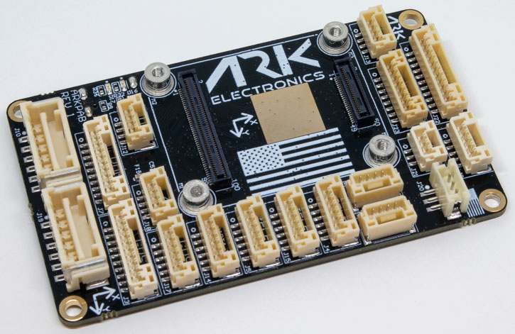

# Hardware Reference

<figure><figcaption>
ARK Pixhawk Autopilot Bus Carrier
</figcaption></figure>

## Specifications

| Specification | Value |
|---------------|-------|
| Form factor | [Pixhawk Autopilot Bus (PAB)](https://github.com/pixhawk/Pixhawk-Standards/blob/master/DS-010%20Pixhawk%20Autopilot%20Bus%20Standard.pdf?_ga=2.20605755.2081055420.1671562222-391294592.1671562222) |
| PAB board-to-board interface | 100-pin Hirose DF40, 40-pin Hirose DF40 |
| Power module inputs | Dual digital power module inputs: 5 V input, I2C power monitor, 6-pin Molex CLIK-Mate |
| Ethernet | 100 Mbps, built-in magnetics, 4-pin JST-GH |
| GPS | Full GPS plus safety switch port, 10-pin JST-GH. Basic GPS port, 6-pin JST-GH |
| CAN | Dual CAN ports, 4-pin JST-GH |
| Telemetry | Triple telemetry ports with flow control, 6-pin JST-GH |
| PWM | Eight PWM outputs, 10-pin JST-GH |
| UART/I2C | 6-pin JST-GH |
| I2C | 4-pin JST-GH |
| RC | PPM RC port, 3-pin JST-GH. DSM RC port, 3-pin JST-ZH |
| SPI | 11-pin JST-GH |
| ADIO | 8-pin JST-GH |
| Debug | 10-pin JST-SH |
| Power | 5 V |
| Dimensions | 74.0 × 43.5 × 12.0 mm, without flight controller module |
| Weight | 22 g, without flight controller module |

## Pinout

See the [Pinout](pinout.md) page for the connector pinouts.


[pinout.md](pinout.md)


## LEDs

There are two LEDs on the ARK PAB:

| LED | Meaning |
|-----|---------|
| Red | Ethernet power |
| Green | Ethernet activity |

## Power

* 5V input on `POWER1`, `POWER2`, `USB C`, and the `USB JST-GH` connector
  * Input is prioritized in the following order: POWER1 > POWER2 > USB. Only the selected input powers the board; see [Carrier Power Inputs](../../knowledge-base/carrier-power-inputs.md)
  * `USB C` and the `USB JST-GH` are in parallel
  * Overvoltage protection at 5.85V
  * Undervoltage protection at 3.81V
* `VDD_5V_HIPOWER` and `VDD_5V_PERIPH` can each provide a total of 1.5A across all the connectors

## 3D Model and Case

| File | Contents |
|------|----------|
| [ARK\_PAB\_Carrier\_3D\_Model.step](https://github.com/ARK-Electronics/ark-hardware/raw/main/ARK_PAB_Carrier/model/ARK_PAB_Carrier_3D_Model.step) | Board |
| [ARK\_PAB\_Carrier\_3D\_PDF.pdf](https://github.com/ARK-Electronics/ark-hardware/raw/main/ARK_PAB_Carrier/model/ARK_PAB_Carrier_3D_PDF.pdf) | Board, 3D PDF |
| [Top\_Case.stl](https://github.com/ARK-Electronics/ark-hardware/raw/main/ARK_PAB_Carrier/case/Top_Case.stl) | Case top |
| [Bottom\_Case.stl](https://github.com/ARK-Electronics/ark-hardware/raw/main/ARK_PAB_Carrier/case/Bottom_Case.stl) | Case bottom |
| [Som\_Case.stl](https://github.com/ARK-Electronics/ark-hardware/raw/main/ARK_PAB_Carrier/case/Som_Case.stl) | Case part for the flight controller module (SOM) |

All files: [ARK\_PAB\_Carrier in ark-hardware](https://github.com/ARK-Electronics/ark-hardware/tree/main/ARK_PAB_Carrier)
