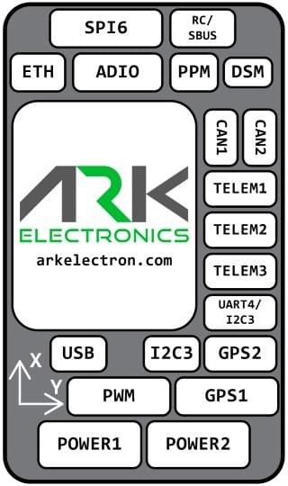

# Pinout

<figure><figcaption></figcaption></figure>

<figure><figcaption>
ARK PAB Carrier connector locations
</figcaption></figure>

### POWER1

| Pin     | Signal    | Volt  |
| ------- | --------- | ----- |
| 1 (red) | `VBRICK1` | +5.0V |
| 2 (blk) | `VBRICK1` | +5.0V |
| 3 (blk) | I2C1\_SCL | +3.3V |
| 4 (blk) | I2C1\_SDA | +3.3V |
| 5 (blk) | `GND`     | GND   |
| 6 (blk) | `GND`     | GND   |

### POWER2

| Pin     | Signal    | Volt  |
| ------- | --------- | ----- |
| 1 (red) | `VBRICK2` | +5.0V |
| 2 (blk) | `VBRICK2` | +5.0V |
| 3 (blk) | I2C2\_SCL | +3.3V |
| 4 (blk) | I2C2\_SDA | +3.3V |
| 5 (blk) | `GND`     | GND   |
| 6 (blk) | `GND`     | GND   |

### PWM

| Pin      | Signal                     | Volt  |
| -------- | -------------------------- | ----- |
| 1 (red)  | VDD\_SERVO (Not Connected) | +5.0V |
| 2 (blk)  | FMU\_CH1                   | +3.3V |
| 3 (blk)  | FMU\_CH2                   | +3.3V |
| 4 (blk)  | FMU\_CH3                   | +3.3V |
| 5 (blk)  | FMU\_CH4                   | +3.3V |
| 6 (blk)  | FMU\_CH5                   | +3.3V |
| 7 (blk)  | FMU\_CH6                   | +3.3V |
| 8 (blk)  | FMU\_CH7                   | +3.3V |
| 9 (blk)  | FMU\_CH8                   | +3.3V |
| 10 (blk) | `GND`                      | GND   |

### GPS1

| Pin      | Signal                    | Volt  |
| -------- | ------------------------- | ----- |
| 1 (red)  | `VDD_5V_PERIPH`           | +5.0V |
| 2 (blk)  | USART1\_TX\_GPS1          | +3.3V |
| 3 (blk)  | USART1\_RX\_GPS1          | +3.3V |
| 4 (blk)  | I2C1\_SCL                 | +3.3V |
| 5 (blk)  | I2C1\_SDA                 | +3.3V |
| 6 (blk)  | nSAFETY\_SWITCH\_IN       | +3.3V |
| 7 (blk)  | nSAFETY\_SWITCH\_LED\_OUT | +3.3V |
| 8 (blk)  | `3V3_FMU`                 | +3.3V |
| 9 (blk)  | BUZZER                    | +5.0V |
| 10 (blk) | `GND`                     | GND   |

### GPS2

| Pin     | Signal           | Volt  |
| ------- | ---------------- | ----- |
| 1 (red) | `VDD_5V_HIPOWER` | +5.0V |
| 2 (blk) | UART8\_TX\_GPS2  | +3.3V |
| 3 (blk) | UART8\_RX\_GPS2  | +3.3V |
| 4 (blk) | I2C2\_SCL        | +3.3V |
| 5 (blk) | I2C2\_SDA        | +3.3V |
| 6 (blk) | `GND`            | GND   |

### TELEM1

| Pin     | Signal           | Volt  |
| ------- | ---------------- | ----- |
| 1 (red) | `VDD_5V_HIPOWER` | +5.0V |
| 2 (blk) | UART7\_TX        | +3.3V |
| 3 (blk) | UART7\_RX        | +3.3V |
| 4 (blk) | UART7\_CTS       | +3.3V |
| 5 (blk) | UART7\_RTS       | +3.3V |
| 6 (blk) | `GND`            | GND   |

### TELEM2

| Pin     | Signal          | Volt  |
| ------- | --------------- | ----- |
| 1 (red) | `VDD_5V_PERIPH` | +5.0V |
| 2 (blk) | UART5\_TX       | +3.3V |
| 3 (blk) | UART5\_RX       | +3.3V |
| 4 (blk) | UART5\_CTS      | +3.3V |
| 5 (blk) | UART5\_RTS      | +3.3V |
| 6 (blk) | `GND`           | GND   |

### TELEM3

| Pin     | Signal           | Volt  |
| ------- | ---------------- | ----- |
| 1 (red) | `VDD_5V_HIPOWER` | +5.0V |
| 2 (blk) | USART2\_TX       | +3.3V |
| 3 (blk) | USART2\_RX       | +3.3V |
| 4 (blk) | USART2\_CTS      | +3.3V |
| 5 (blk) | USART2\_RTS      | +3.3V |
| 6 (blk) | `GND`            | GND   |

### UART4/I2C3

| Pin     | Signal          | Volt  |
| ------- | --------------- | ----- |
| 1 (red) | `VDD_5V_PERIPH` | +5.0V |
| 2 (blk) | UART4\_TX       | +3.3V |
| 3 (blk) | UART4\_RX       | +3.3V |
| 4 (blk) | I2C3\_SCL       | +3.3V |
| 5 (blk) | I2C3\_SDA       | +3.3V |
| 6 (blk) | `GND`           | GND   |

### I2C3

| Pin     | Signal          | Volt  |
| ------- | --------------- | ----- |
| 1 (red) | `VDD_5V_PERIPH` | +5.0V |
| 2 (blk) | I2C3\_SCL       | +3.3V |
| 3 (blk) | I2C3\_SDA       | +3.3V |
| 4 (blk) | `GND`           | GND   |

### CAN1

| Pin     | Signal           | Volt  |
| ------- | ---------------- | ----- |
| 1 (red) | `VDD_5V_HIPOWER` | +5.0V |
| 2 (blk) | CAN1\_H          | +3.3V |
| 3 (blk) | CAN1\_L          | +3.3V |
| 4 (blk) | `GND`            | GND   |

### CAN2

| Pin     | Signal          | Volt  |
| ------- | --------------- | ----- |
| 1 (red) | `VDD_5V_PERIPH` | +5.0V |
| 2 (blk) | CAN2\_H         | +3.3V |
| 3 (blk) | CAN2\_L         | +3.3V |
| 4 (blk) | `GND`           | GND   |

### USB

All signals in parallel with USB C connector

| Pin     | Signal    | Volt  |
| ------- | --------- | ----- |
| 1 (red) | `VBUS_IN` | +5.0V |
| 2 (blk) | USB\_N    | +3.3V |
| 3 (blk) | USB\_P    | +3.3V |
| 4 (blk) | `GND`     | GND   |

### ETH

| Pin     | Signal     | Volt            |
| ------- | ---------- | --------------- |
| 1 (red) | ETH\_RD\_N | +50.0V Tolerant |
| 2 (blk) | ETH\_RD\_P | +50.0V Tolerant |
| 3 (blk) | ETH\_TD\_N | +50.0V Tolerant |
| 4 (blk) | ETH\_TD\_P | +50.0V Tolerant |

### ADIO

| Pin     | Signal          | Volt  |
| ------- | --------------- | ----- |
| 1 (red) | `VDD_5V_PERIPH` | +5.0V |
| 2 (blk) | FMU\_CAP        | +3.3V |
| 3 (blk) | BOOTLOADER      | +3.3V |
| 4 (blk) | FMU\_RST\_REQ   | +3.3V |
| 5 (blk) | nARMED          | +3.3V |
| 6 (blk) | ADC1\_3V3       | +3.3V |
| 7 (blk) | ADC1\_6V6       | +3.3V |
| 8 (blk) | `GND`           | GND   |

### RC/SBUS

| Pin     | Signal               | Volt  |
| ------- | -------------------- | ----- |
| 1 (red) | `VDD_5V_SBUS_RC`     | +5.0V |
| 2 (blk) | USART6\_RX\_SBUS\_IN | +3.3V |
| 3 (blk) | USART6\_TX           | +3.3V |
| 4 (blk) | `VDD_3V3_SPEKTRUM`   | +3.3V |
| 5 (blk) | `GND`                | GND   |

### PPM

| Pin     | Signal                     | Volt  |
| ------- | -------------------------- | ----- |
| 1 (red) | `VDD_5V_PPM_RC`            | +5.0V |
| 2 (blk) | DSM\_INPUT/FMU\_PPM\_INPUT | +3.3V |
| 3 (blk) | `GND`                      | GND   |

### DSM

| Pin     | Signal                     | Volt  |
| ------- | -------------------------- | ----- |
| 1 (red) | `VDD_3V3_SPEKTRUM`         | +3.3V |
| 2 (blk) | `GND`                      | GND   |
| 3 (blk) | DSM\_INPUT/FMU\_PPM\_INPUT | +3.3V |

### SPI6

| Pin      | Signal          | Volt  |
| -------- | --------------- | ----- |
| 1 (red)  | `VDD_5V_PERIPH` | +5.0V |
| 2 (blk)  | SPI6\_SCK       | +3.3V |
| 3 (blk)  | SPI6\_MISO      | +3.3V |
| 4 (blk)  | SPI6\_MOSI      | +3.3V |
| 5 (blk)  | SPI6\_nCS1      | +3.3V |
| 6 (blk)  | SPI6\_nCS2      | +3.3V |
| 7 (blk)  | SPIX\_nSYNC     | +3.3V |
| 8 (blk)  | SPI6\_DRDY1     | +3.3V |
| 9 (blk)  | SPI6\_DRDY2     | +3.3V |
| 10 (blk) | SPI6\_nRESET    | +3.3V |
| 11 (blk) | `GND`           | GND   |

### Debug Port

| Pin      | Signal             | Volt  |
| -------- | ------------------ | ----- |
| 1 (red)  | `Vtref`            | +3.3V |
| 2 (blk)  | Console TX (OUT)   | +3.3V |
| 3 (blk)  | Console RX (IN)    | +3.3V |
| 4 (blk)  | `SWDIO`            | +3.3V |
| 5 (blk)  | `SWCLK`            | +3.3V |
| 6 (blk)  | `SWO`              | +3.3V |
| 7 (blk)  | NFC GPIO           | +3.3V |
| 8 (blk)  | PH11               | +3.3V |
| 9 (blk)  | nRST               | +3.3V |
| 10 (blk) | `GND`              | GND   |
