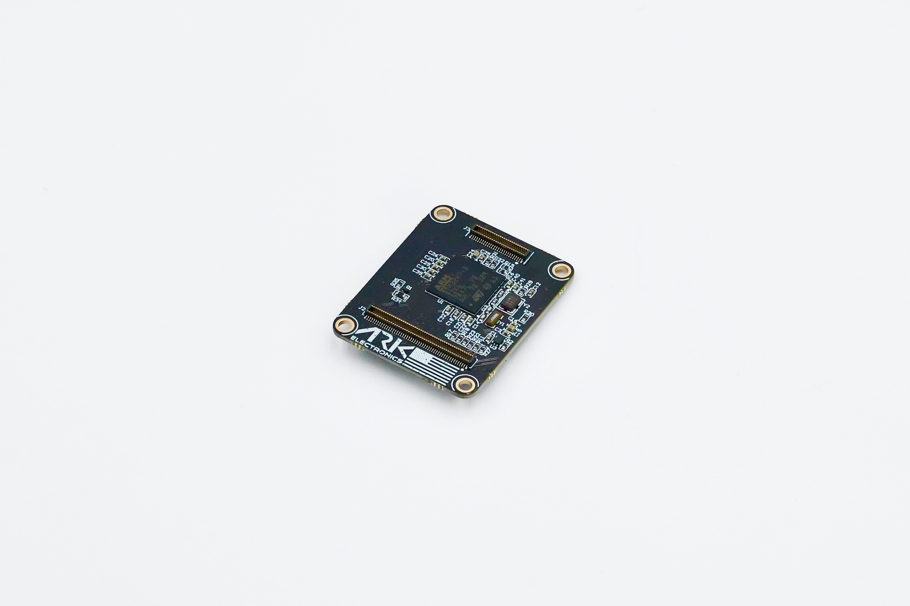

# Hardware Reference

<figure><figcaption>
ARK Electronics ARKV6S
</figcaption></figure>

## Specifications

| Specification | Value |
|---------------|-------|
| MCU | [STM32H743IIK6](https://www.st.com/en/microcontrollers-microprocessors/stm32h743ii.html), 480 MHz, 2 MB flash, 1 MB RAM |
| IMU | [Invensense IIM-42653](https://invensense.tdk.com/products/smartindustrial/iim-42653/) industrial IMU |
| Barometer | [Bosch BMP390](https://www.bosch-sensortec.com/products/environmental-sensors/pressure-sensors/bmp390/) |
| Magnetometer | [ST IIS2MDC](https://www.st.com/en/mems-and-sensors/iis2mdc.html) |
| Memory | FRAM |
| Form factor | [Pixhawk Autopilot Bus (PAB)](https://github.com/pixhawk/Pixhawk-Standards/blob/master/DS-010%20Pixhawk%20Autopilot%20Bus%20Standard.pdf) |
| Heater | 1 W. Keeps sensors warm in extreme conditions |
| Storage | MicroSD slot |
| Indicators | LEDs |
| Power | 5 V, 500 mA: 300 mA main system, 200 mA heater |
| Dimensions | 3.6 × 2.9 × 0.5 cm |
| Weight | 5.0 g |

## Pinout

For pinout of the ARKV6S see the [DS-10 Pixhawk Autopilot Bus Standard](https://github.com/pixhawk/Pixhawk-Standards/blob/master/DS-010%20Pixhawk%20Autopilot%20Bus%20Standard.pdf).

## Serial Port Mapping

| UART   | Device     | Port          |
| ------ | ---------- | ------------- |
| USART1 | /dev/ttyS0 | GPS           |
| USART2 | /dev/ttyS1 | TELEM3        |
| USART3 | /dev/ttyS2 | Debug Console |
| UART4  | /dev/ttyS3 | UART4 & I2C   |
| UART5  | /dev/ttyS4 | TELEM2        |
| USART6 | /dev/ttyS5 | PX4IO/RC      |
| UART7  | /dev/ttyS6 | TELEM1        |
| UART8  | /dev/ttyS7 | GPS2          |

## Datasheet

* [ARKV6S](https://github.com/ARK-Electronics/ark-hardware/blob/main/ARKV6S/datasheet/ARKV6S_Datasheet.pdf)

## 3D Model and Case

| File | Contents |
|------|----------|
| [ARKV6S.step](https://github.com/ARK-Electronics/ark-hardware/raw/main/ARKV6S/model/ARKV6S.step) | Board |

All files: [ARKV6S in ark-hardware](https://github.com/ARK-Electronics/ark-hardware/tree/main/ARKV6S)
