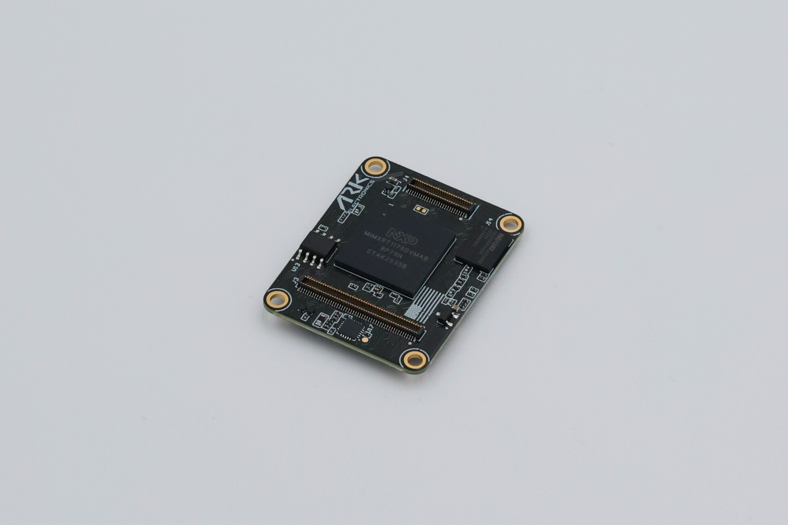
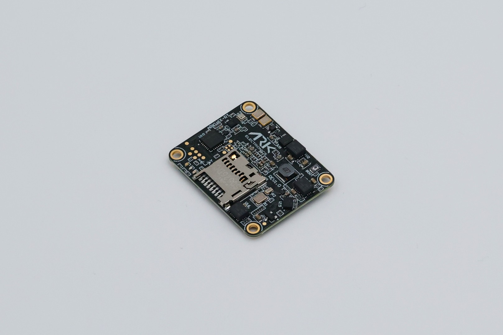

# ARKV6X-RT


The ARKV6X-RT is a flight-controller module. It needs a Pixhawk Autopilot Bus carrier, such as the [ARK Pixhawk Autopilot Bus Carrier](../ark-pixhawk-autopilot-bus-carrier/README.md). Wiring connectors (GPS, TELEM, CAN, PWM, Ethernet, power) are on the carrier. See the [ARK Pixhawk Autopilot Bus Carrier Pinout](../ark-pixhawk-autopilot-bus-carrier/pinout.md).


The USA-built ARKV6X-RT is an NXP i.MX RT1176 variant of the [ARKV6X](../arkv6x/README.md), based on the [FMUv6X-RT and Pixhawk Autopilot Bus open source standards](https://github.com/pixhawk/Pixhawk-Standards). Triple synced IMUs make data averaging, voting, and filtering possible. The Pixhawk Autopilot Bus (PAB) form factor lets the module sit on any [PAB-compatible carrier](https://docs.px4.io/main/en/flight_controller/pixhawk_autopilot_bus.html).

[PX4 Autopilot](px4-instructions.md) ships on the board. Rev 1.0 is the revision in production.

Order from [ARK Electronics](https://arkelectron.com/product/arkv6xrt/).

<figure><figcaption>
ARKV6X-RT Rev 1.0, PAB connector side
</figcaption></figure>

<figure><figcaption>
ARKV6X-RT Rev 1.0, MicroSD side
</figcaption></figure>

### Revisions

Rev 1.0 and Rev 2.0 share the processor, memory, magnetometer, heater, and PAB connectors. The sensor set and the barometer bus change.

|                          | Rev 1.0 (shipping)                                      | Rev 2.0                                              |
| ------------------------ | ------------------------------------------------------- | ---------------------------------------------------- |
| IMU, SPI1                | [ICM-45686](https://www.invensense.tdk.com/en-us/products/6-axis/icm-45686) | [LSM6DSV32X](https://www.st.com/en/mems-and-sensors/lsm6dsv32x.html) |
| IMU, SPI2                | [IIM-20670](https://www.invensense.tdk.com/en-us/products/motion-tracking/6-axis/iim-20670) | LSM6DSV32X                                           |
| IMU, SPI3                | [LSM6DSV80X](https://www.st.com/en/mems-and-sensors/lsm6dsv80x.html) | LSM6DSV32X                                           |
| Barometer                | [BMP390](https://www.bosch-sensortec.com/products/environmental-sensors/pressure-sensors/pressure-sensors-bmp390.html) on I2C2, address 0x76 | BMP390 on I2C3, address 0x76                         |
| Magnetometer             | [IIS2MDC](https://www.st.com/en/mems-and-sensors/iis2mdc.html) on I2C3, address 0x1E | IIS2MDC on I2C3, address 0x1E                        |
| FMUM hardware revision   | 0 (`ARKV6XRT000`)                                       | 1                                                    |

Each IMU has its own SPI bus, power rail, and data-ready line. On Rev 2.0 the BMP390 shares I2C3 with the IIS2MDC. The two parts use different addresses.

PX4 starts the Rev 1.0 IMUs when the hardware type is `ARKV6XRT000`, and it probes the BMP390 on I2C2. Rev 2.0 needs a build that recognizes FMUM revision 1. See [PX4 Instructions](px4-instructions.md).

### Processor

* [NXP i.MX RT1176](https://www.nxp.com/products/i.MX-RT1170), MIMXRT1176DVMAB
  * 1 GHz Arm Cortex-M7. PX4 clocks this core at 996 MHz.
  * 400 MHz Arm Cortex-M4. PX4 leaves this core idle.
  * 2 MB RAM
* Code store is a 64 MB Macronix MX25UM51345G octal NOR on FlexSPI1. The RT1176 fetches instructions from that flash (execute-in-place). PX4 uses the first 4 MB.
* [NXP EdgeLock SE051](https://www.nxp.com/products/SE051) secure element, I2C address 0x48

### Sensors

Rev 1.0, the revision that ships:

* [Invensense ICM-45686](https://www.invensense.tdk.com/en-us/products/6-axis/icm-45686) on SPI1. ±32 g / ±4000 dps. Primary IMU, and the heater sense point.
* [Invensense IIM-20670](https://www.invensense.tdk.com/en-us/products/motion-tracking/6-axis/iim-20670) on SPI2. ±65.5 g / ±1966 dps.
* [ST LSM6DSV80X](https://www.st.com/en/mems-and-sensors/lsm6dsv80x.html) on SPI3. PX4 publishes the ±16 g / ±4000 dps channel. The part's ±80 g element is left off. High-g coverage on this revision is the IIM-20670.
* [Bosch BMP390](https://www.bosch-sensortec.com/products/environmental-sensors/pressure-sensors/pressure-sensors-bmp390.html) on I2C2, address 0x76
* [ST IIS2MDC](https://www.st.com/en/mems-and-sensors/iis2mdc.html) on I2C3, address 0x1E

Rev 2.0 replaces U9, U10, and U15 with three [ST LSM6DSV32X](https://www.st.com/en/mems-and-sensors/lsm6dsv32x.html) IMUs (±32 g / ±4000 dps) on the same three SPI buses, and moves the BMP390 to I2C3.

### Other Features

* Infineon FM25V02A FRAM, 256 Kbit (32 KB), on FlexSPI2. PX4 stores parameters here.
* [Pixhawk Autopilot Bus (PAB) form factor](https://github.com/pixhawk/Pixhawk-Standards/blob/master/DS-010%20Pixhawk%20Autopilot%20Bus%20Standard.pdf)
  * 100-pin Hirose DF40C-100DP-0.4V(51)
  * 50-pin Hirose DF40C-50DP-0.4V(51)
* 1 W heater on 5 V, about 200 mA, for warming the sensors in extreme cold
* Red, green, and blue LED indicators
* MicroSD slot. A MicroSD card is included.
* Onboard boot button. Held, it selects the ROM serial downloader. Released, the board boots from the programmed fuses.
* USA built, NDAA compliant

### Interfaces

These signals are on the PAB connectors. A carrier decides which of them reach a jack.

* 12 FMU PWM outputs. A carrier with PX4IO adds 8 more.
* Eight serial ports: GPS1, GPS2, TELEM1, TELEM2, TELEM3, TELEM4, PX4IO/RC, and the debug console
* Four I2C buses. I2C3 holds the onboard IIS2MDC. On Rev 1.0 the BMP390 is on I2C2, which is shared with the carrier PM2 connector. On Rev 2.0 the BMP390 is on I2C3.
* SPI1, SPI2, and SPI3 serve the onboard IMUs. SPI6 is the external bus, with two chip selects, two data-ready lines, and a reset.
* CAN1, CAN2, and CAN3. The default PX4 build enables two CAN interfaces.
* 100BASE-T Ethernet on ENET2. The module drives RMII, PHY power, and the PHY interrupt. The PHY, magnetics, and jack are on the carrier.
* USB
* MicroSD
* SWD and the system console, on the carrier FMU Debug connector

### Power Requirements

* 5 V, from the carrier
* 500 mA
  * 300 mA for the main system
  * 200 mA for the heater

### Additional Information

* Weight: 5.0 g
* Dimensions: 3.6 x 2.9 x 0.5 cm

### Pinout

The board-to-board pinout is the [DS-010 Pixhawk Autopilot Bus Standard](https://github.com/pixhawk/Pixhawk-Standards/blob/master/DS-010%20Pixhawk%20Autopilot%20Bus%20Standard.pdf).

GPS, TELEM, CAN, PWM, Ethernet, and power connectors are on the carrier.


[pinout.md](../ark-pixhawk-autopilot-bus-carrier/pinout.md)


### Serial Port Mapping

PX4 on the ARKV6X-RT. Flow control is CTS/RTS on the TELEM ports that have it.

| UART     | Device     | Port            | Flow control |
| -------- | ---------- | --------------- | :----------: |
| LPUART1  | /dev/ttyS0 | Debug Console   |      No      |
| LPUART3  | /dev/ttyS1 | GPS1            |      No      |
| LPUART4  | /dev/ttyS2 | TELEM1          |     Yes      |
| LPUART5  | /dev/ttyS3 | GPS2            |      No      |
| LPUART6  | /dev/ttyS4 | PX4IO / RC      |      No      |
| LPUART8  | /dev/ttyS5 | TELEM2          |     Yes      |
| LPUART10 | /dev/ttyS6 | TELEM3          |     Yes      |
| LPUART11 | /dev/ttyS7 | TELEM4          |      No      |


The bootloader brings up LPUART8 only. UART flashing talks to TELEM2. See [PX4 Instructions](px4-instructions.md).

