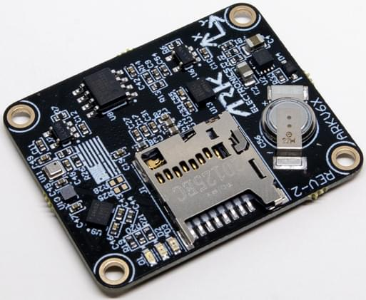

# Hardware Reference

<figure><figcaption>
ARK Electronics ARKV6X
</figcaption></figure>

## Specifications

| Specification | Value |
|---------------|-------|
| MCU | [STM32H743IIK6](https://www.st.com/en/microcontrollers-microprocessors/stm32h743ii.html), 480 MHz, 2 MB flash, 1 MB RAM |
| IMUs | [Dual Invensense ICM-42688-P](https://invensense.tdk.com/products/motion-tracking/6-axis/icm-42688-p/) and [Invensense IIM-42652](https://invensense.tdk.com/products/smartindustrial/iim-42652/) industrial IMU, triple synced |
| IMUs, Extended Range | [Triple Invensense IIM-42653](https://invensense.tdk.com/products/smartindustrial/iim-42653/) industrial IMUs: 4000 dps gyroscope and 32 g accelerometer, against 2000 dps and 16 g on the IIM-42652 and ICM-42688-P |
| Barometer | [Bosch BMP390](https://www.bosch-sensortec.com/en/products/environmental-sensors/pressure-sensors/bmp390) |
| Magnetometer | [Bosch BMM150](https://www.bosch-sensortec.com/media/boschsensortec/downloads/datasheets/bst-bmm150-ds001.pdf) |
| Memory | FRAM |
| Form factor | [Pixhawk Autopilot Bus (PAB)](https://github.com/pixhawk/Pixhawk-Standards/blob/master/DS-010%20Pixhawk%20Autopilot%20Bus%20Standard.pdf) |
| Heater | 1 W. Keeps sensors warm in extreme conditions |
| Storage | MicroSD slot |
| Indicators | LEDs |
| Power | 5 V, 500 mA: 300 mA main system, 200 mA heater |
| Mounting | PAB. In the bundles, the module is screwed into the ARK PAB Carrier with four M2×8 mm screws |
| Dimensions | 3.6 × 2.9 × 0.5 cm |
| Weight | 5.0 g |

## Pinout


**Using the ARKV6X on an ARK PAB Carrier?** See the [ARK Pixhawk Autopilot Bus Carrier Pinout](../ark-pixhawk-autopilot-bus-carrier/pinout.md).


For pinout of the ARKV6X board-to-board connectors see the [DS-10 Pixhawk Autopilot Bus Standard](https://github.com/pixhawk/Pixhawk-Standards/blob/master/DS-010%20Pixhawk%20Autopilot%20Bus%20Standard.pdf).

All wiring connectors — GPS, TELEM, CAN, PWM, and the rest — are broken out by the carrier board, not the ARKV6X itself. For the ARK PAB Carrier, see:


[pinout.md](../ark-pixhawk-autopilot-bus-carrier/pinout.md)


## Serial Port Mapping

| UART   | Device     | Port          |
| ------ | ---------- | ------------- |
| USART1 | /dev/ttyS0 | GPS           |
| USART2 | /dev/ttyS1 | TELEM3        |
| USART3 | /dev/ttyS2 | Debug Console |
| UART4  | /dev/ttyS3 | UART4 & I2C   |
| UART5  | /dev/ttyS4 | TELEM2        |
| USART6 | /dev/ttyS5 | PX4IO/RC      |
| UART7  | /dev/ttyS6 | TELEM1        |
| UART8  | /dev/ttyS7 | GPS2          |

## Datasheet

* [ARKV6X](https://github.com/ARK-Electronics/ark-hardware/blob/main/ARKV6X/datasheet/ARKV6X_Datasheet.pdf)

## 3D Model and Case

The ARKV6X Extended Range uses the same board model.

| File | Contents |
|------|----------|
| [ARKV6X\_3D\_Model.step](https://github.com/ARK-Electronics/ark-hardware/raw/main/ARKV6X/model/ARKV6X_3D_Model.step) | Board |
| [ARKV6X\_3D\_PDF.pdf](https://github.com/ARK-Electronics/ark-hardware/raw/main/ARKV6X/model/ARKV6X_3D_PDF.pdf) | Board, 3D PDF |

All files: [ARKV6X in ark-hardware](https://github.com/ARK-Electronics/ark-hardware/tree/main/ARKV6X)
