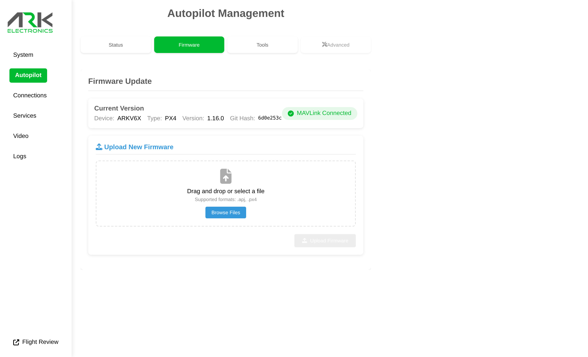

# Updating the Flight Controller Firmware

## From the Web UI

Open the [ARK-UI](http://jetson.local) **Autopilot** page, select the **Firmware** tab, and upload a `.px4` or `.apj` firmware file.

<figure><figcaption></figcaption></figure>

## From the Command Line

SSH into the Jetson and run the ARK-OS flashing tool (on `PATH`):

```bash
flash_firmware.sh <firmware.px4>
```

Run without an argument to flash the PX4 image bundled with ARK-OS.

## Firmware Binaries

* **PX4**: `ark_fmu-v6x` builds from the [PX4 releases page](https://github.com/PX4/PX4-Autopilot/releases/)
* **ArduPilot**: `ARK_FMU_V6X` builds from [firmware.ardupilot.org](https://firmware.ardupilot.org/)

If the flight controller does not enumerate over USB, recover the bootloader over SWD: [ST-LINK Flashing Guide](../../../knowledge-base/st-link-flashing-guide.md#flashing-px4-flight-controllers).
