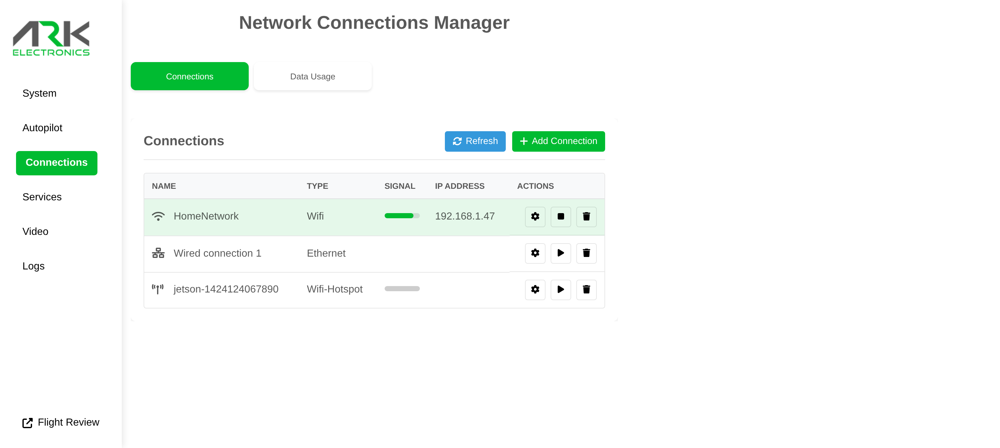

# Get Online

## From ARK-UI

Open [http://jetson.local](http://jetson.local) (or [http://192.168.55.1](http://192.168.55.1) over Micro USB) and join a network from the **Connections** page:

<figure><figcaption><p>ARK-UI Connections page</p></figcaption></figure>

## From the Command Line

Scan for networks:

```bash
sudo nmcli device wifi
```

Connect to a network:

```bash
sudo nmcli device wifi connect 'SSID' password 'PASSWORD'
```

## Sharing Your PC's Internet over USB

The kernel repo ships a helper that NATs the Jetson's traffic out through your host PC's WiFi — see [share\_wifi.sh](https://github.com/ARK-Electronics/ark_jetson_kernel/blob/main/scripts/share_wifi.sh).

You can also bake a WiFi profile into the image before flashing with `./scripts/add_wifi_network.sh PAB <ssid> <password>`.
