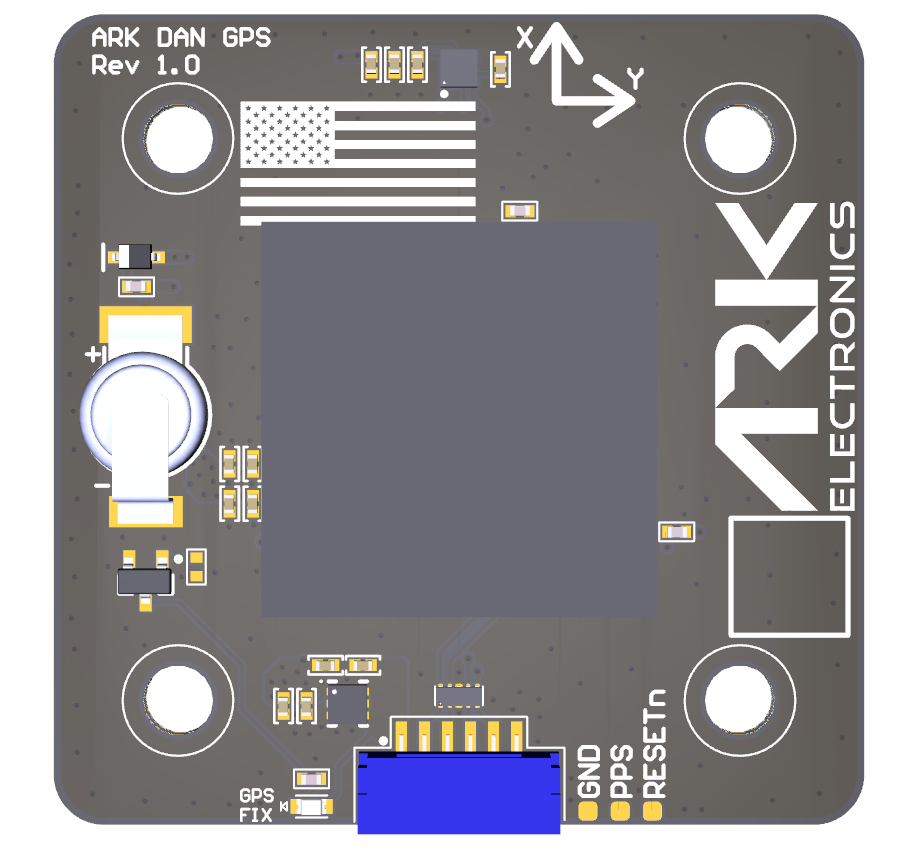

# Betaflight Instructions

### Firmware Setup 

In the [Betaflight Configurator](https://app.betaflight.com/), open the Configuration tab, under Other Features enable GPS, select save and reboot.

### Magnetometer Orientation

When using Betaflight, the mag driver flips the X axis of the sensor. Positive X axis to match Betaflight means the DAN GPS connector is facing the front of the vehicle.

<figure><figcaption>
Betaflight Mag Orientation
</figcaption></figure>
