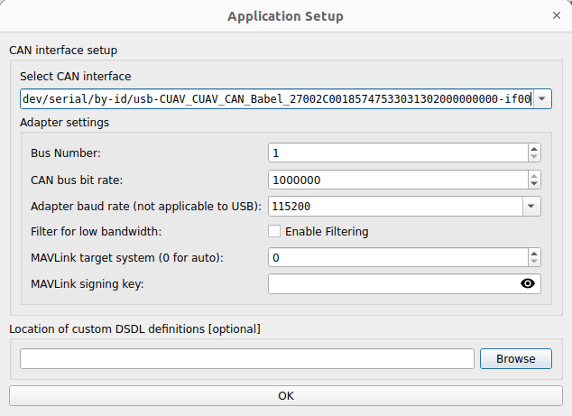
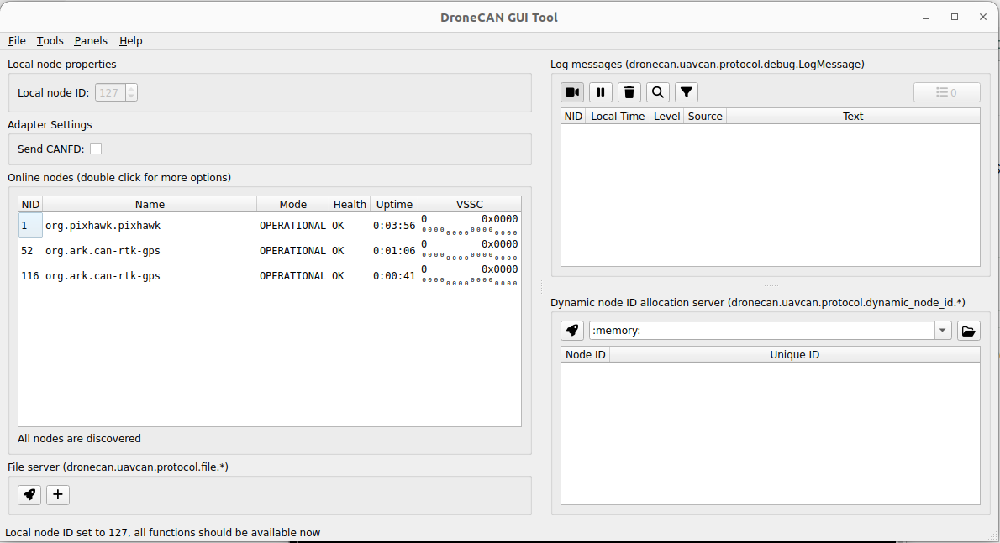
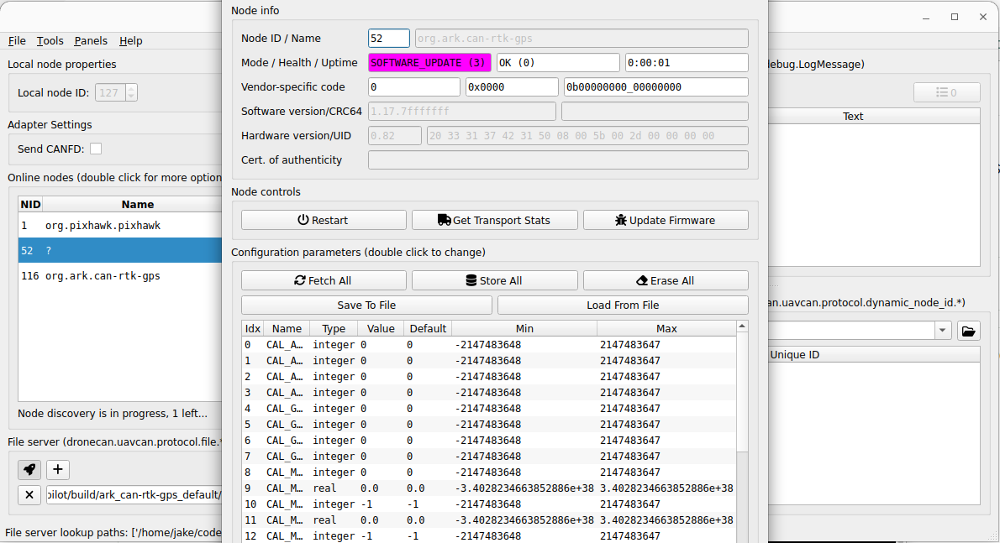
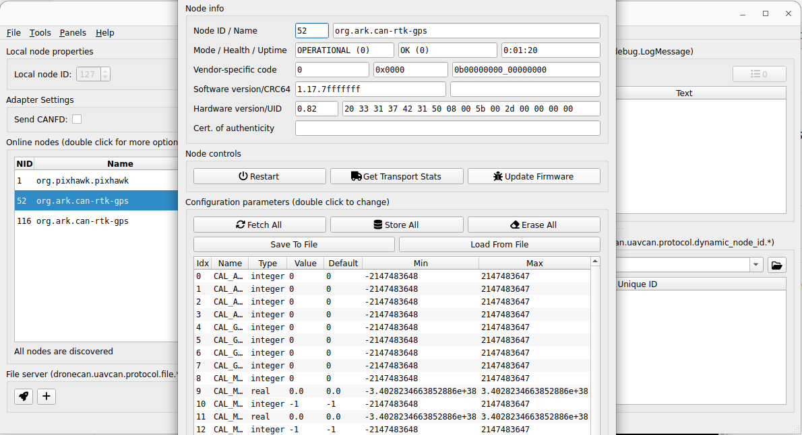
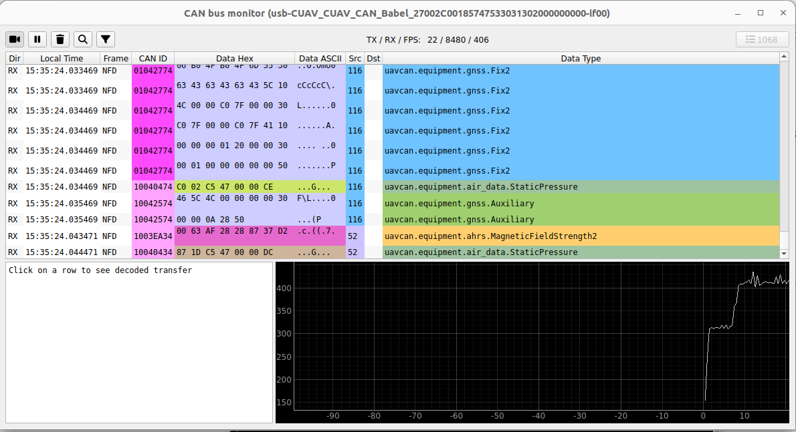

# DroneCAN GUI Tool Guide

## Overview

The DroneCAN GUI Tool is an open source application for managing DroneCAN devices. It allows you to:

* Upload firmware to DroneCAN nodes
* View and modify device parameters
* Monitor CAN bus traffic in real-time

This guide covers using the tool with ARK DroneCAN products such as the ARK Flow, ARK CANnode, ARK DIST, ARK MAG, and ARK GPS modules.



***

## Installation

Install the required dependencies and the DroneCAN GUI Tool on Ubuntu:

```bash
sudo apt-get install -y python3-pip python3-setuptools python3-wheel
sudo apt-get install -y python3-numpy python3-pyqt5 python3-pyqt5.qtsvg git-core
python3 -m pip install git+https://github.com/DroneCAN/gui_tool@master
```

Run the tool with:

```bash
dronecan_gui_tool
```

***

## Connecting to DroneCAN Devices

### PX4 - USB to CAN Adapter

PX4 requires a USB-to-CAN adapter that supports the SLCAN protocol to connect to DroneCAN devices. The Zubax Babel is a commonly used adapter.

1. Connect the adapter to your CAN bus and plug it into your computer via USB
2. Launch the DroneCAN GUI Tool
3. Select the adapter's serial port from the dropdown
4. Set the CAN bus bit rate to 1000000 (1 Mbps)
5. Click OK to connect
6. Once connected press the "Set" button to the right of "Set local node ID."





### ArduPilot - Flight Controller as CAN Interface

With ArduPilot, the flight controller can act as a CAN interface, eliminating the need for a separate USB-to-CAN adapter.

#### SLCAN

SLCAN exposes the CAN bus over the flight controller's USB serial port. This is the simplest method when the vehicle is not armed.

This is already enabled by default on ARK boards running Ardupilot.

* [SLCAN on F7/H7 Autopilots](https://ardupilot.org/copter/docs/common-slcan-f7h7.html)


SLCAN access is disabled when the vehicle is armed to reduce CPU load.


#### MAVCAN

MAVCAN tunnels CAN frames over a MAVLink connection. This method works while armed and over any MAVLink link (USB, telemetry radio, etc.).

To connect via MAVCAN in the DroneCAN GUI Tool, enter the connection string with the `mavcan:` prefix, for example `mavcan:udp:14550`.


It is not recommended to run MAVCAN while the vehicle is armed, due to the high amount of link traffic it creates.


***

## Firmware Upload

DroneCAN nodes that require firmware will appear with a status of MAINTENANCE in the node list.

To upload firmware:

1. Double-click on the node to open its properties window
2. Click **Update Firmware**
3. Select the firmware file for your device

**Firmware file formats:**

* `.bin` - AP\_Periph firmware (ArduPilot)
* `.uavcan.bin` - PX4 CANnode firmware


Check the individual ARK product documentation pages for which firmware types are supported by each device.




***

## Parameter Configuration

To view and modify device parameters:

1. Double-click on a node in the node list to open its properties window
2. Click **Fetch All** to retrieve parameters from the device
3. Edit parameter values as needed
4. Click **Send** to write the changed parameters to the device



***

## Bus Monitor

The Bus Monitor provides real-time visibility into CAN bus traffic, useful for debugging and verifying device communication.

To open the Bus Monitor:

1. Go to **Tools** in the menu bar
2. Select **Bus Monitor**
3. Press the camera icon to begin capturing frames
4. Press the pause icon to stop cature and review

The Bus Monitor displays:

* CAN message types and data type names
* Source and destination node IDs
* Decoded message contents


