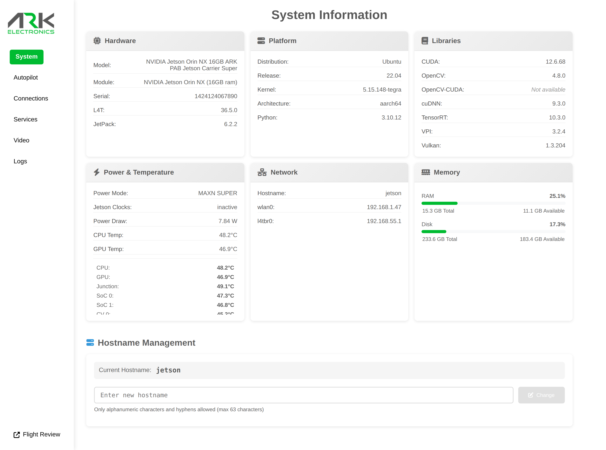

---
metaLinks:
  alternates:
    - ../ark-jetson-pab-carrier/getting-started.md
---

# Getting Started

## What's Pre-Installed

Bundles ship ready to use — no flashing required:

* **Jetson**: Latest ARK Jetson image (JetPack 6 / L4T r36) on the NVMe SSD, with [ARK-OS](https://github.com/ARK-Electronics/ARK-OS) pre-installed
* **Flight Controller**: Latest PX4 stable firmware
* **Credentials**: Username `jetson`, password `jetson`, hostname `jetson`


The default password is well known — change it (`passwd`) before putting the vehicle on a network you don't control.


## Connecting to Your Jetson

### Option 1: USB-C

Connect the USB-C port to your PC. The Jetson appears as a USB network device with IP `192.168.55.1`:

```bash
ssh jetson@192.168.55.1
```

The web UI is also reachable this way at [http://192.168.55.1](http://192.168.55.1) — handy for joining a WiFi network from the **Connections** page.

### Option 2: WiFi Hotspot

On first boot, if no known WiFi network is available, the Jetson brings up a hotspot:

* **Network**: `jetson-<serial>`
* **Password**: `password`

Connect to the hotspot, open [http://jetson.local](http://jetson.local), and join your WiFi network from the **Connections** page:

<figure><figcaption><p>ARK-UI Connections page</p></figcaption></figure>

Once the Jetson is on your network:

```bash
ssh jetson@jetson.local
```


**MHF4 antenna cables are required for WiFi and are not included.** Compatible MHF4 to RP-SMA cables: [option 1](https://www.amazon.com/female-Pigtail-Antenna-Extension-wireless/dp/B07GTL2G69), [option 2](https://www.amazon.com/dp/B076SGTMFS). Some bundles ship without the WiFi card — the hotspot only appears when a WiFi card is installed.


### Option 3: Ethernet

Connect the 4-pin JST-GH Ethernet port to your network — the Jetson requests an address over DHCP. The onboard switch also connects the flight controller and the Pixhawk Payload Bus (see [Autopilot Connections](autopilot-connections/)).

## ARK-UI Web Interface

ARK-OS hosts a web UI at [http://jetson.local](http://jetson.local) for managing the device: system info, autopilot status and firmware updates, network connections, services, video streaming, and flight logs.

<figure><figcaption><p>ARK-UI System page</p></figcaption></figure>

## Next Steps

* [ARK-OS](ark-services/) - The pre-installed services and web UI
* [Autopilot Connections](autopilot-connections/) - Connect QGroundControl or Mission Planner
* [Camera Overlays](camera-overlays.md) - CSI cameras and device tree overlays
* [Flashing Guide](flashing-guide.md) - Update or re-flash the Jetson
