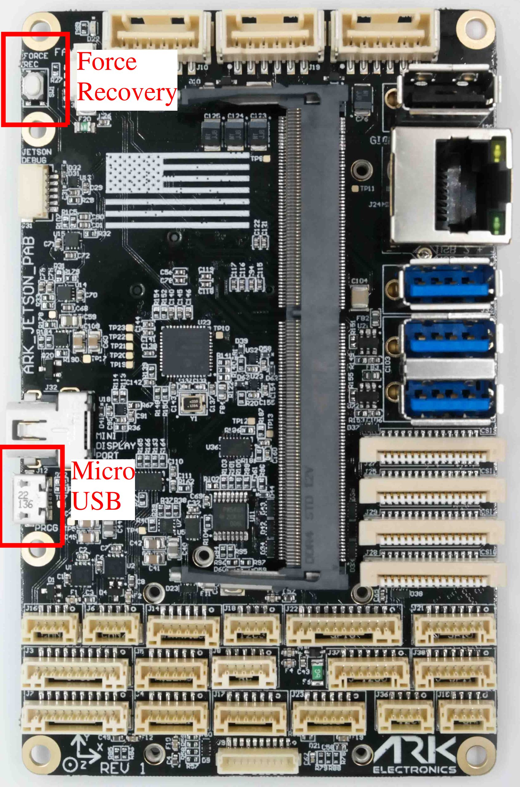

# Flashing Guide

If you purchased a bundle the [Jetpack Ubuntu OS](https://developer.nvidia.com/embedded/jetpack) is already installed along with [ARK-OS](https://github.com/ARK-Electronics/ARK-OS). Follow this guide if you want to update to the latest Jetpack or need to flash your Jetson for the first time.

## ARK Jetson Kernel GitHub Repository

The repository provides prebuilt flash packages (recommended) and scripts to build the kernel from source. Follow the README:\
[https://github.com/ARK-Electronics/ark\_jetson\_kernel](https://github.com/ARK-Electronics/ark_jetson_kernel)

## Device Tree

The ARK Jetson PAB Carrier requires a custom device tree to enable all hardware features. The device tree files are located here:\
[https://github.com/ARK-Electronics/ark\_jetson\_kernel/tree/main/products/PAB/device\_tree](https://github.com/ARK-Electronics/ark_jetson_kernel/tree/main/products/PAB/device_tree)

## Overview

To flash the kernel you will need to connect the Jetson to your Host PC using the **Micro USB** connection. You must boot the jetson while holding the **Force Recovery** button.\

