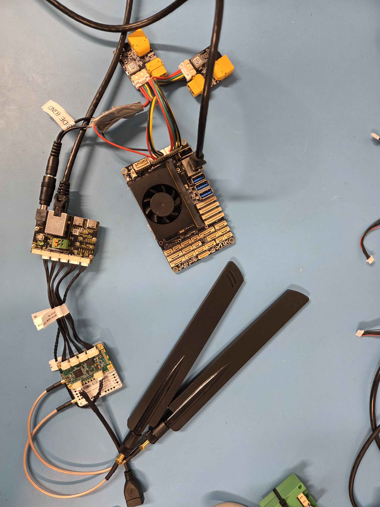
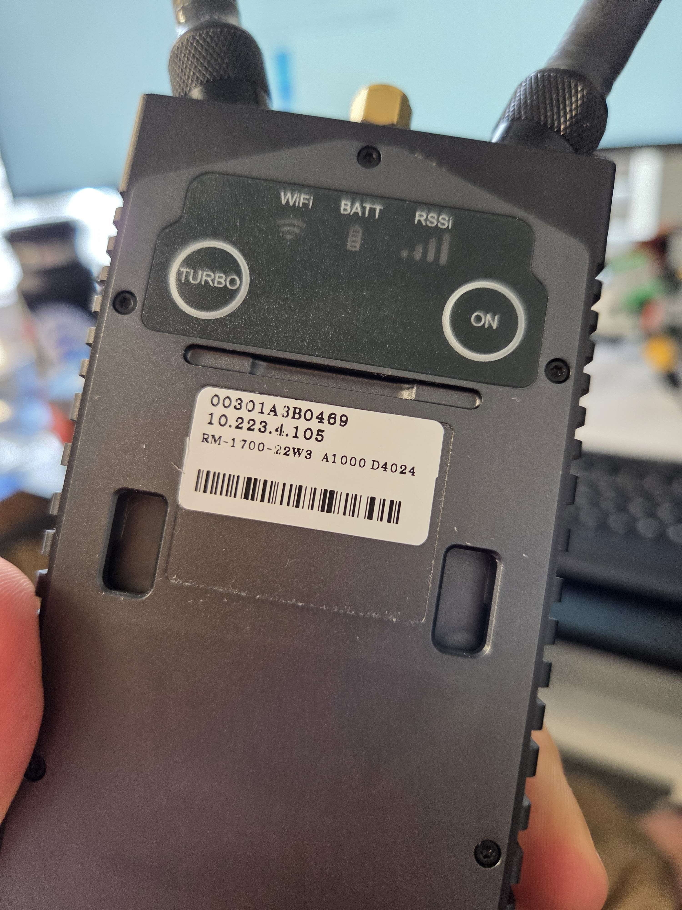

# Doodle Labs Mesh Rider Radio Integration Guide for ARK Jetson PAB Carrier



## Introduction

This guide provides step-by-step instructions for integrating the **Doodle Labs Mesh Rider Radio system** with the **ARK Jetson PAB Carrier**, designed for seamless deployment in UAV and robotic platforms.\
It covers hardware connections, software configuration, and troubleshooting tips to enable robust, high-throughput wireless communication over a private mesh network using the Doodle Labs platform. Standard Wi-Fi modes are also supported for more conventional networking setups.

Whether you're setting up a new vehicle or retrofitting an existing system, this integration guide ensures a reliable link between the **Jetson-based** companion computer and the ground control station, optimized for use with **ROS 2, PX4, MAVLink**, and other **ARK Electronics software frameworks**.

## Hardware setup

The Doodle Labs **Mini and Nano OEM radios** require an external **5 V power supply** to operate reliably. For airborne and mobile robotics platforms, we recommend using ARK Electronics power solutions that provide regulated and protected output.

To power the system, use **two separate power modules**:

* One power module to supply the **ARK Jetson PAB Carrier / Jetson**
* A second power module to supply the **Mini or Nano OEM radio**

Because the radio operates at **5 V**, it can be powered using either the **ARK 12S Power Module** or the **ARK 12S Payload Power Module**. Using separate power modules adds redundancy, which is beneficial for overall system reliability—especially for the Jetson companion computer.

<br>

<figure><figcaption></figcaption></figure>


**Note:** A **5 V barrel jack (5.5 mm × 2.5 mm, center-positive)** rated for **at least 3 A** is required to power on the Mini/Nano OEM radio.


In addition to power, connect an **Ethernet cable** from the radio’s **LAN port** directly to the Ethernet port on the **ARK Jetson PAB Carrier**. This wired connection enables high-throughput, low-latency data exchange between the Jetson companion computer and the mesh network formed by the Doodle Labs radios.

<figure><figcaption></figcaption></figure>

## Jetson setup

After connecting the radio, you can SSH into the pre-flashed Jetson via **Micro USB** to continue configuration or verify connectivity.\
Once connected via SSH, set a **static IP address** on the Jetson that matches the radio network’s subnet. This allows seamless communication with the **Mini/Nano OEM radio** and other devices on the mesh network.

```
sudo nmcli connection modify "Wired connection 1" ipv4.addresses 10.223.0.101/16
sudo nmcli connection modify "Wired connection 1" ipv4.method manual
sudo nmcli connection modify "Wired connection 1" ipv4.gateway 10.223.0.1

sudo nmcli connection down "Wired connection 1"
sudo nmcli connection up "Wired connection 1"
```

After setting the static IP, you can disconnect the USB connection and **restart the Jetson**. Once it reboots, you should be able to **SSH into the Jetson over the network** via the IP address you assigned.

<figure><figcaption><p>Login page at the IP</p></figcaption></figure>

<figure><figcaption><p>Dashboard</p></figcaption></figure>

## Ground station radio setup

This section provides detailed instructions for setting up and connecting to Doodle Labs Mesh Rider Radios.\
Your options are:

* Wearable
* Mini & Nano OEM
* OEM

Regardless which radio you use as the base station the network setup is the same.

After establishing a connection through Ethernet, you must set a static IP address for your host machine within the 10.223.0.0/16 subnet to access the radios. The method for assigning an IP address differs between operating systems (Windows, macOS, Linux, etc.).

For a Windows 10 or later system, navigate to the Network Connections folder in the Control Panel. Right-click on the Wi-Fi or Ethernet adapter your host is using and select Properties. In the properties window, choose Internet Protocol Version 4 and then click Properties. Set the IP address to the 10.223.0.0/16 subnet. Since these addresses are statically assigned, make sure not to use the same IP address for another device on the network. Refer to the figure below for guidance on manually setting the IP address.

<figure><figcaption></figcaption></figure>

For Linux:

```
nmcli connection modify "Wired connection 1" ipv4.addresses 10.223.0.100/16
nmcli connection modify "Wired connection 1" ipv4.method manual
nmcli connection modify "Wired connection 1" ipv4.gateway 10.223.0.1
nmcli connection modify "Wired connection 1" ipv4.dns "8.8.8.8 1.1.1.1"

nmcli connection down "Wired connection 1"
nmcli connection up "Wired connection 1"
```

Once the setup is complete you can go ahead and open a web browser and navigate to the IP address written on your device.

<figure><figcaption><p>IP on the Wearable</p></figcaption></figure>

The default configuration of the Mesh Rider radios allows Mesh Rider radios of identical band models to automatically form a mesh on first boot-up without any configuration changes. You can immediately run IP-based connections over the Mesh Rider network. The configuration should be adjusted for your application and match both on the radios.

With this setup, your Jetson is part of your IP network, which means if it’s running a MAVLink server or any MAVLink-compatible device, you should be able to connect to it via QGroundControl (QGC) over the network. Additionally, you can access the Jetson remotely using SSH for monitoring or configuration tasks.

<figure><figcaption><p>Dashboard</p></figcaption></figure>

<figure><figcaption><p>Simple mesh configuration</p></figcaption></figure>

**Wi-Fi Connection (only for wearable and OEM)**

You can connect to the radio over its built-in Wi-Fi radio. By default, the built-in Wi-Fi radio starts up an Access Point with SSID DoodleLabsWiFi-\<last 6 hex digits of MAC> and password DoodleSmartRadio. No cables are required for this connection method.

<figure><figcaption><p>Wi-Fi setup</p></figcaption></figure>

### Establishing the connection

Once you set up all the static IP-s on both the Ground PC and the Jetson you can go ahead and power up the drone. You'll be able to reach to both IP-s from the Ground PC and you can also **SSH** to the Jetson from the established network.

`jetson.local` should load, here you can interact with our services<br>

<figure><figcaption><p>ARK OS</p></figcaption></figure>

<figure><figcaption><p>RTSP server is ready at IP:5600/camera1</p></figcaption></figure>

### **QGround Control**

You can go ahead and add the Link for the Drone in QGC, `jetson.local` should give you the correct address you set previously.

<figure><figcaption><p>Adding the UDP connection</p></figcaption></figure>

Finally, you can add the RTSP video stream using the same IP and `:5600/camera1`

<figure><figcaption><p>RTSP setup</p></figcaption></figure>

As you can see below the connection and the camera stream are established. We are ready to fly.

<figure><figcaption><p>Connection and stream are ready</p></figcaption></figure>

Resources:<br>



[ark-jetson-pab-carrier](../flight-controller/jetson-pabs/ark-jetson-pab-carrier/ "mention")
