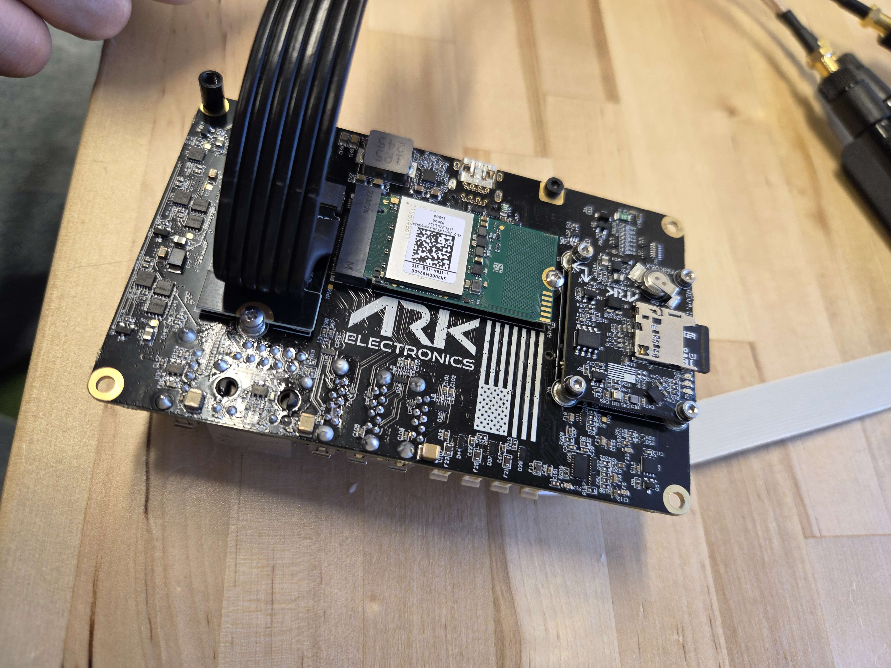
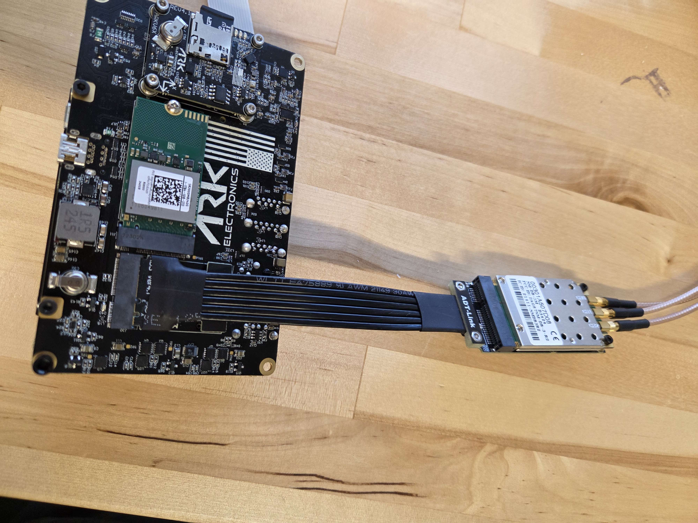
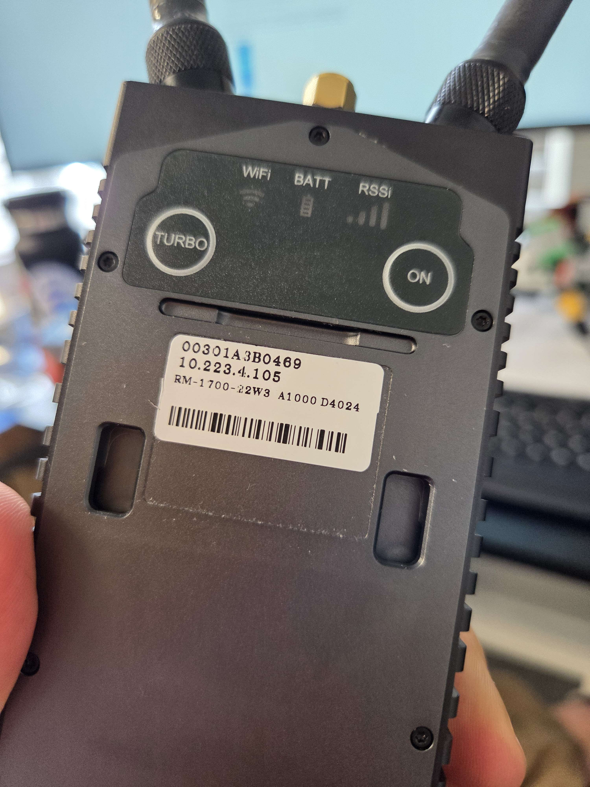

# Doodle Labs Nimble Integration Guide for ARK Jetson PAB Carrier



## Introduction

This guide provides step-by-step instructions for integrating the **Doodle Labs Nimble radio system** with the **ARK Jetson PAB Carrier**, designed for seamless deployment in UAV and robotic platforms.

It covers hardware connections, software configuration, and troubleshooting tips to enable robust, high-throughput wireless communication over a **private WDS network** using the Doodle Labs platform. Standard Wi-Fi modes are also supported for more conventional networking setups.

Whether you're setting up a new vehicle or retrofitting an existing system, this integration guide ensures a reliable link between the **Jetson-based companion computer** and ground control station, optimized for use with **ROS2, PX4, MAVLink**, and other ARK Electronics software frameworks.


## Hardware setup

Install the **M.2 Key E to mini PCIe adapter** in the slot previously occupied by the Wi-Fi module. If you're using the recommended **ADT-Link adapter**, insert it into the M.2 slot and secure it with a screw.

<figure><figcaption><p><strong>ADT-Link adapter connected to the</strong> ARK Jetson PAB Carrier</p></figcaption></figure>

Next, insert the **Doodle Labs Nimble radio** into the **mini PCIe connector** on the adapter and ensure it is firmly seated.

<figure><figcaption><p><strong>Doodle Labs Nimble radio connected to the adapter</strong></p></figcaption></figure>

## Jetson setup

The Nimble software package is tightly coupled to the kernel version and requires **Linux 5.15.136-tegra**, which is included in **JetPack 6.0**.

You can also re-flash your Jetson using our [ark\_jetson\_kernel](https://github.com/ARK-Electronics/ark_jetson_kernel) repository with the commit corresponding to JetPack 6.0, to ensure compatibility. You can find more instructions for re-flashing the Jetson in our [Flashing Guide](../flight-controller/ark-jetson-pab-carrier/flashing-guide.md).

```
git clone https://github.com/ARK-Electronics/ark_jetson_kernel.git
cd ark_jetson_kernel
git reset --hard 1f16d8707a30732356679c7921868204a80082b0
```

Once you flashed the required OS you have to share your internet with the Jetson via the USB connection.

```
cd ark_jetson_kernel
./share_wifi.sh 
```

Once you are done you should ssh to your Jetson:

```
ssh jetson@jetson.local
```

Password:**jetson**\
\
You should also install the [ark-software](../flight-controller/ark-jetson-pab-carrier/ark-software/ "mention")

## Nimble setup

### Installing prerequisites

Make sure you have internet connection on the Jetson, then ssh to it.

Install iperf3. iperf3 is a useful tool for throughput testing.

```
sudo apt install iperf3
```

Install bridge-utils. This allows you to run the brctl command.

```
sudo apt install bridge-utils
```

Install socat. This allows you to use the messaging system from the command line.

```
sudo apt install socat
```

Install Additional Packages for Remote Access: Install htop, nload, iperf and screen for enhanced remote monitoring and networking utilities.

```
sudo apt update && sudo apt install htop nload iperf screen nano
```

Modify Network Manager Settings to unmanaged the Wireless NIC: If you want to ensure the wireless network interface card (NIC) is no longer managed by NetworkManager, modify its configuration file

```
sudo nano /etc/NetworkManager/NetworkManager.conf
```

At the end of the file, add the following lines:

```
[keyfile]

unmanaged-devices=interface-name:wl*
```

To apply the changes made to the configuration file, restart the NetworkManager service

```
sudo systemctl restart NetworkManager
```

### Software Setup: Nimble Kernel Drivers <a href="#software-setup-nimble-kernel-drivers" id="software-setup-nimble-kernel-drivers"></a>

**Please contact your Doodle Labs Sales Representative for the Nimble Software package**

The Nimble software package has both kernel space driver and user space applications and libraries packaged into multiple .deb Debian packages. The kernel driver packages for 802.11n is coupled to specific version of Kernel. Below is the list of kernel specific debian packages we will be installing.

<figure><figcaption></figcaption></figure>

On the Jetson, create a folder \~/Nimble and copy the Nimble Software Package to this folder.

From your local machine you can copy the following commands

```
scp 2025.01-Nimble-Sense-Orin/nimble_config.tar jetson@jetson.local:/home/jetson/Nimble
scp backports-5.15.136-tegra_6.6.15-1_arm64.deb jetson@jetson.local:/home/jetson/Nimble
scp iw_5.19-1_arm64.deb jetson@jetson.local:/home/jetson/Nimble
```

On the Jetson you should install the packages

```
cd Nimble
sudo dpkg -i backports-5.15.136-tegra_6.6.15-1_arm64.deb hostap_0.0-1_arm64.deb iw_5.19-1_arm64.deb
```

Reboot the board

```
sudo reboot
```

Check that the radio interface is running by running

```
lsmod | grep compat
```

You should see the following output

```
compat       12ss288 4 ath9k_common,ath9k,mac80211,cfg80211
```

### Software Setup: Nimble Front End Software <a href="#software-setup-nimble-front-end-software" id="software-setup-nimble-front-end-software"></a>

By default, Ubuntu uses the Network Manager service for network configuration. We have already stopped the Network Manager from managing wireless interfaces. We will be using the Nimble Front-end software to manage the wireless interface by using wpa-supplicant, hostapd, and isc-dhcp-server. The Nimble Front-End provides a unified configuration interface for wireless configuration, IP configuration, traffic prioritization, and _Sense_. The Front-End also enables compatibility with Doodle Labs Mesh Rider radios.

The following files are provided for Front-End Installation.

<figure><figcaption></figcaption></figure>

In the nimble folder you should extract the files above

```
cd Nimble
tar -xf nimble_installer.tar
tar -xf nimble_config.tar
```

## Supported Networking Modes <a href="#supported-networking-modes" id="supported-networking-modes"></a>

One of the two main networking layouts we expect Nimble to operate as is Nimble as Access Point and Client, the photo below is an example of such a layout. The Nimble radio is integrated into a ground control station and acts as an Access Point. The drones are each integrated with a Nimble radio and are configured to be clients.

There are two ways to proceed. One option is to configure for Nimble to be in Access Point mode and the other is to configure Nimble to be in Client/Station mode.

### Wifi AP/Client

#### Client Mode

To install and configure the radio to be in Client mode do the following

Navigate to the Nimble/nimble\_installer directory in a terminal and run the following command

```
cd Nimble/nimble_installer
sudo ./nimble_installer.sh Client 
```

Reboot the device after installation is complete

```
sudo reboot
```

The device will act as a WiFi Client device with the following parameters

**SSID: wireless-hotspot** \
**PSK: DoodleSmartRadio**\
**IP: DHCP Client**

If an access point is running with the above credentials, on the same channel and bandwidth (it should be if it is the default Nimble AP installation). Check if this client/station is connected to AP using following commands, please use the DoodleLabs WiFi card interface name, for example “wlp3s0”

```
sudo iw wlp3s0 info 
sudo iw wlp3s0 station dump 
```

#### Access Point Mode

To install and configure the radio to be in AP mode do the following

Navigate to the Nimble/nimble\_installer directory in a terminal and run the following command

```
cd Nimble/nimble_installer
sudo ./nimble_installer.sh AP 
```

Reboot the device after installation is complete

```
sudo reboot
```

Check if the AP is functional using iw command, please use the DoodleLabs WiFi card interface name, for example “wlp3s0”

```
sudo iw wlp3s0 info
```

The device will act as a WiFi AP with the following settings

**SSID: wireless-hotspot**\
**PSK: DoodleSmartRadio**\
**IP: 10.223.3.1/16 and running a DHCP server**

#### **Notes**

You can switch between AP and Client mode by running the nimble\_installer.sh script again with the desired mode and rebooting.

## **Nimble Software Configuration Utility**

The Nimble configuration utility is provided to help users with the most common wireless and networking configurations. To configure the Nimble transceiver, navigate to the nimble\_config folder /Nimble/nimble\_config/then run the nimble\_config shell script as root.

```
cd /Nimble/nimble_config
sudo ./nimble_config.sh 
```

The menu items that are available depend on whether you installed the radio in AP or STA (Client) mode. The basic menu structure is as follows

<details>

<summary>AP Mode</summary>

**Wireless AP config**\
Update SSID\
Update Password\
Channel and bandwidth\
Optimize for P2P\
Enable/Disable Hostapd (1/0)

**Traffic Prioritization config**\
Display Rules\
Add Rule\
Delete Rule

**Sense config**\
Update ACS list\
License check\
Enable/Disable Sense

**IP Address config**\
Enable/Disable DHCP Server\
DHCP server config\
Set static IP

**Enable/Disable Mesh Rider interoperability in AP**\
Enable/Disable Mesh Rider interoperability (0/1)

</details>

<details>

<summary><strong>Client Mode</strong></summary>

**Wireless STA config**\
Update SSID\
Update Password\
Update chanbw\
Enable/Disable wpasupplicant (1/0)

**Traffic prioritization config**\
Display Rules\
Add Rule\
Delete Rule

**Sense config**\
Update ACS list\
License check\
Enable/Disable Sense

**IP Address Config**\
Set Static IP\
Enable dynamic IP

**Enable/Disable Mesh Rider interoperability in STA**\
Enable/Disable Mesh Rider interoperability (0/1)

</details>

Note: Any changes made in the configuration using nimble\_config will be reflected only after ‘exit’ option of that submenu is selected and returned to the parent menu.

## **WDS Client/WDS AP**

The other networking layout we expect is for customers to use Nimble in Mesh Rider interoperability mode. This allows Nimble to function as either WDS AP or WDS Client. The Mesh Rider radio must also be configured to operate in the appropriate WDS AP or WDS Client mode. Here is a possible network setup possible with Nimble and Mesh Rider.

<figure><figcaption></figcaption></figure>

The default mode on Nimble is with Mesh Rider Radio interoperability disabled, and it acts as a normal AP/Client. To achieve the Mesh Rider <-> Nimble network architecture as illustrated in the network diagram above, Mesh Rider interoperability must be enabled using the Nimble Configuration script nimble\_config.sh mentioned earlier.&#x20;

This will allow the Nimble radio to connect with Mesh Rider radios in WDS AP/Client mode. The Mesh Rider radio also needs to be configured in WDS mode for Nimble to connect.&#x20;

You have to be in Client/AP Mode already, then you can enable WDS using Nimble Software Configuration Utility.\


To configure the Nimble transceiver, navigate to the nimble\_config folder /Nimble/nimble\_config/then run the nimble\_config shell script as root.

```
cd /Nimble/nimble_config
sudo ./nimble_config.sh 
```

Select option 5 and enter 1 to Enable Meshrider interoperability then select 6 to exit to save and close the Configuration Utility



Select option 5&#x20;

To edit Meshrider interoperability



Enter 1&#x20;

To enable Meshrider interoperability



Select option 6&#x20;

To exit to save and close the Configuration Utility



<figure><figcaption><p>WDS Client mode</p></figcaption></figure>

<figure><figcaption><p>WDS AP mode</p></figcaption></figure>

## Ground station radio setup

This section provides detailed instructions for setting up and connecting to Doodle Labs Mesh Rider Radios.\
Your options are:

* Wearable
* Mini & Nano OEM
* OEM

Regardless which radio you use as the base station the network setup is the same.&#x20;

After establishing a connection through Ethernet, you must set a static IP address for your host machine within the 10.223.0.0/16 subnet to access the radios. The method for assigning an IP address differs between operating systems (Windows, macOS, Linux, etc.).&#x20;

For a Windows 10 or later system, navigate to the Network Connections folder in the Control Panel. Right-click on the Wi-Fi or Ethernet adapter your host is using and select Properties. In the properties window, choose Internet Protocol Version 4 and then click Properties. Set the IP address to the 10.223.0.0/16 subnet. Since these addresses are statically assigned, make sure not to use the same IP address for another device on the network. Refer to the figure below for guidance on manually setting the IP address.

<figure><figcaption></figcaption></figure>

For Linux:

<pre><code><strong>nmcli connection modify "Wired connection 1" ipv4.addresses 10.223.0.100/16
</strong>nmcli connection modify "Wired connection 1" ipv4.method manual
nmcli connection modify "Wired connection 1" ipv4.gateway 10.223.0.1
nmcli connection modify "Wired connection 1" ipv4.dns "8.8.8.8 1.1.1.1"

# Apply changes by restarting the connection
nmcli connection down "Wired connection 1"
nmcli connection up "Wired connection 1"
</code></pre>

Once the setup is complete you can go ahead and and open a web browser and navigate to the IP address written on your device

<figure><figcaption></figcaption></figure>

Key setups for connection

Same SSID

* Same SSID
* Same Key
* Same Frequency (2.4ghz band should be one both of the radios can talk on)
* Same bandwidth

On the Jetson you could run the following command to see the correct setup

```
sudo iw wlan0 info
```

<figure><figcaption></figcaption></figure>

<figure><figcaption><p>WDS AP on Ground Control Station Radio</p></figcaption></figure>


<figure><figcaption><p>WDS Client on Ground Control Station Radio</p></figcaption></figure>

<figure><figcaption><p>Ground station in AP</p></figcaption></figure>

<figure><figcaption><p>Ground station in Client</p></figcaption></figure>

Once you have established the connection you should remove the usb connection and reboot the Jetson.

With this setup, your Jetson is part of your IP network, which means if it’s running a MAVLink server or any MAVLink-compatible device, you should be able to connect to it via QGroundControl (QGC) over the network. Additionally, you can access the Jetson remotely using SSH for monitoring or configuration tasks.

Resources:\








[ark-jetson-pab-carrier](../flight-controller/ark-jetson-pab-carrier/ "mention")
