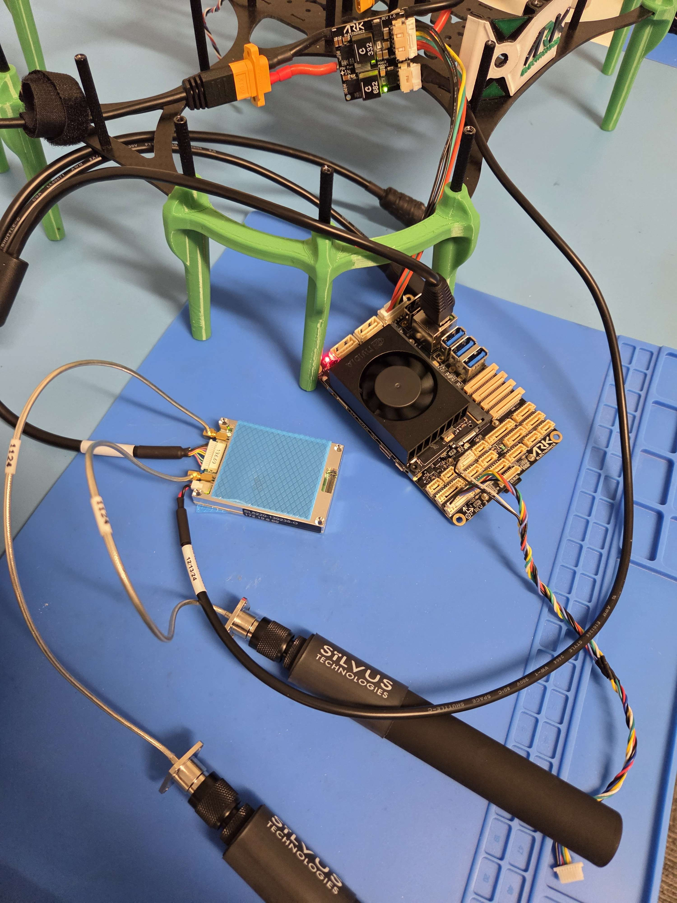
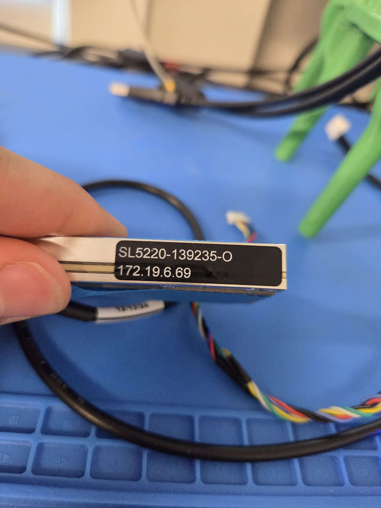
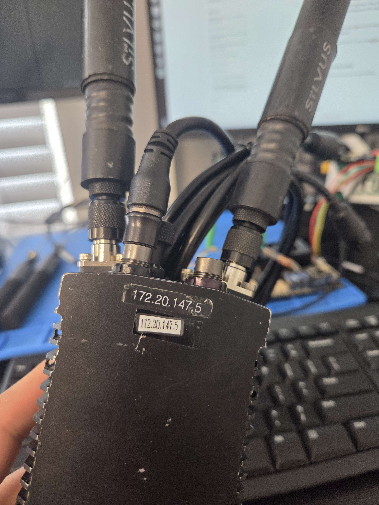

# Silvus StreamCaster SL5200 (OEM Module) MANET radio integration Guide for ARK Jetson PAB Carrier



## Introduction

This guide provides step-by-step instructions for integrating the **Silvus StreamCaster SL5200 MANET radio system** with the **ARK Jetson PAB Carrier**, enabling seamless deployment in UAV and robotic platforms.

It covers hardware connections, software configuration, and troubleshooting tips to establish a robust, high-throughput wireless link over a private **Silvus MN-MIMO mesh network**. Standard IP networking features such as multicast support, adaptive data rates, and self-forming mesh capabilities are leveraged to ensure resilient communication in dynamic environments.

Whether you're configuring a new vehicle or upgrading an existing system, this integration guide ensures a reliable connection between the Jetson-based companion computer and your ground control station—optimized for use with **ROS2**, **PX4**, **MAVLink**, and other **ARK Electronics software frameworks**.

## Hardware setup

The **StreamCaster SL5200 radio** requires external power to operate reliably. We recommend using the **ARK 12S Payload Power Module**, which provides regulated and protected power suitable for airborne and mobile robotics platforms.

In addition to powering the SL5200, connect an Ethernet cable from the radio's LAN port directly to the **Ethernet port on the ARK Jetson PAB Carrier**. This connection enables high-throughput data exchange between the Jetson companion computer and the mesh network formed by the Silvus radios.

⚠️ Ensure all connections are secure and that antennas are properly attached to avoid damage during operation.

<figure><figcaption></figcaption></figure>


<figure><figcaption></figcaption></figure>

## Silvus StreamCaster SL5200 OEM Module Setup

You should connect your  SL5200 radio to your PC for the Network setup using the Ethernet cable.\
After establishing a connection to the **StreamCaster SL5200** radio via Ethernet, you must configure a **static IP address** on your host machine within the `172.19.0.0/16` subnet in order to communicate with the radio network.

The process for assigning a static IP address varies depending on your operating system (e.g., Windows, macOS, Linux).

**For Windows 10 or Later**

1. Open the **Control Panel** and go to the **Network and Sharing Center**.
2. Click **Change adapter settings** on the left sidebar.
3. Right-click the **Ethernet adapter** connected to the radio and choose **Properties**.
4. Select **Internet Protocol Version 4 (TCP/IPv4)** and click **Properties**.
5. Manually set the IP address to a value within the `172.19.6.0/16` subnet.\
   For example, use:
   * **IP address:** `172.19.6.100`
   * **Subnet mask:** `255.240.0.0`
   * **Default gateway:** `172.19.6.1` (optional, but recommended)

> ⚠️ These IP addresses are statically assigned. Be sure not to reuse an IP address that is already in use on the network to avoid conflicts.

Refer to the figure below for a visual guide on manually configuring the IP address in Windows.

<figure><figcaption></figcaption></figure>

For Linux:

```
sudo nmcli connection modify "Wired connection 1" ipv4.addresses 172.19.6.200/16
sudo nmcli connection modify "Wired connection 1" ipv4.method manual
sudo nmcli connection modify "Wired connection 1" ipv4.gateway 172.19.6.1
sudo nmcli connection modify "Wired connection 1" ipv4.dns "8.8.8.8 1.1.1.1"

# Apply the changes
sudo nmcli connection down "Wired connection 1"
sudo nmcli connection up "Wired connection 1"
```

Then you should navigate to the IP of your radio in your browser.&#x20;

<figure><figcaption></figcaption></figure>

<figure><figcaption><p>Basic Configuration</p></figcaption></figure>

#### Radio Configuration Parameters

When setting up the **StreamCaster SL5200** radio, it’s important to configure the following parameters to ensure optimal performance and compatibility with your application. These settings can typically be found in the radio's web-based management interface.

* **Frequency (MHz):**\
  Specifies the operating frequency of the radio signal. A drop-down menu allows you to select from available frequencies.\
  **Recommended setting:** `2220 MHz`\
  ⚠️ _Use caution when selecting frequencies._ Operating in or near common Wi-Fi bands may lead to interference. Consult your local radio spectrum regulations to ensure compliance and avoid conflicts.
* **Bandwidth:**\
  Defines the RF bandwidth of the transmitted signal. This value determines data rate and spectrum occupancy.\
  **Default value is generally sufficient** for most use cases.
* **Network ID:**\
  Used to create separate clusters of radios operating on the same frequency. Radios will only communicate with others that share the same Network ID, enabling parallel networks without cross-talk.
* **Link Distance (meters):**\
  Set this to the maximum expected distance between any two radios in the network. This parameter ensures the system allows enough time for packets to travel over the air.\
  **Recommendation:** Set the link distance **10–15% longer** than the actual maximum separation between nodes.
* **Total Transmit Power (requested):**\
  Determines the total output power of the signal, which is divided equally across all antenna ports.\
  **Note:** Use only the necessary power for your application to conserve energy and comply with local transmission limits. For our tests, **a low power setting has proven sufficient**.
* **Routing Mode:**\
  Configures the mesh networking mode. In SS5, Large Network mode is the default and only available option, making it the recommended setting for compatibility and ease of setup.

<figure><figcaption><p>Advanced configuration</p></figcaption></figure>

**Transmit/Receive Channels**: Allows user to Enable or Disable each channel on the radio for TX/RX (each RF port is a channel). We have enabled both channels.

<figure><figcaption><p><strong>RS-232 settings</strong></p></figcaption></figure>


**Serial Port Configuration: RS-232**

To establish RS-232 communication through the **StreamCaster SL5200** radio, ensure the serial settings are correctly configured on both ends of the link.

**RS-232 Serial Port Settings**

The following parameters must match on both communicating devices:

* **Baud Rate**
* **Data Bits**
* **Parity**
* **Stop Bits**
* **Software Flow Control:** _Disabled_
* **Transport Protocol:**
  * **UDP** is recommended for low-latency applications.
  * If no data loss can be tolerated, use **TCP** on the radio corresponding to the air-side device.
* **Peer IP:**\
  Set this to the IP address of the radio connected to the other end of the RS-232 link.
  * For example, if configuring the ground-side radio, set the Peer IP to the IP of the air-side radio.

⚠️ _Note:_ Both radios should share the same configuration, except for the **Peer IP**, which must point to the opposing unit.

After completing these settings, you can connect the radio to the Jetson via Ethernet to enable network communication.

### Ground Station Radio Setup

The setup process for the ground station radio is largely similar to that of the air-side unit.

**Configuring Static IP for the Ground Radio (**&#x53;ilvus StreamCaster 4200E&#x50;**)**

To ensure reliable communication with the air unit and associated systems, assign a **static IP address** to the Silvus StreamCaster 4200EP (SC4200EP) that resides within the same subnet as the radio network.

**Example Configuration**

If the air-side radio (or the radio connected to the Jetson) uses the IP address `172.20.147.5`, then configure the ground radio with:

* **Subnet mask:** `255.240.0.0` (/16)
* **IP address:** A unique address in the same subnet, such as `172.20.147.200`
* **Note:** Ensure the chosen IP does not conflict with the air unit or any other device on the network.

**Configuration via Terminal (Linux using `nmcli`)**

If you are configuring the **Silvus StreamCaster 4200EP** from a Linux-based interface (e.g., Ubuntu running on the radio or a connected ground computer), use the following `nmcli` commands to set a static IP:

```
sudo nmcli connection modify "Wired connection 1" ipv4.addresses 172.20.147.200/16
sudo nmcli connection modify "Wired connection 1" ipv4.method manual
sudo nmcli connection modify "Wired connection 1" ipv4.gateway 172.20.147.1
sudo nmcli connection modify "Wired connection 1" ipv4.dns "8.8.8.8 1.1.1.1"

# Apply the changes
sudo nmcli connection down "Wired connection 1"
sudo nmcli connection up "Wired connection 1"

```

<figure><figcaption></figcaption></figure>

Once the static IP address is assigned, you can access the radio’s web interface by navigating to its IP address in a browser.

Use the same configuration settings as previously described for the air unit.\
The **key difference** is the **Peer IP** — this should be set to the IP address of the **air-side radio**.

This ensures proper two-way communication between the ground and air units.\


<figure><figcaption></figcaption></figure>

You can then view all connected devices by navigating to the **Network Topology** section in the radio’s web interface.

<figure><figcaption></figcaption></figure>

After completing the setup, you should update your computer’s static IP address to match the subnet of the **AIR unit's IP**. This ensures continued access and communication with the air-side radio during normal operation.

```
sudo nmcli connection modify "Wired connection 1" ipv4.addresses 172.19.6.100/16
sudo nmcli connection modify "Wired connection 1" ipv4.gateway 172.19.6.1
sudo nmcli connection modify "Wired connection 1" ipv4.method manual
sudo nmcli connection up "Wired connection 1"
```

On Windows:

* Go to **Network & Sharing Center → Adapter settings**
* Right-click your Ethernet → Properties → IPv4
* Manually set IP to: `172.19.6.100`
* Subnet mask: `255.240.0.0`
* Gateway: `172.19.6.1`


## Jetson setup

After connecting the radio, you can **SSH into the pre-flashed Jetson** via USB to continue configuration or verify connectivity.

Once connected via SSH, set a static IP address on the Jetson that matches the radio network’s subnet. This allows seamless communication with the Silvus radio and other devices on the mesh network.

```
sudo nmcli connection modify "Wired connection 1" ipv4.addresses 172.19.6.200/16
sudo nmcli connection modify "Wired connection 1" ipv4.method manual
sudo nmcli connection modify "Wired connection 1" ipv4.gateway 172.19.6.1
sudo nmcli connection modify "Wired connection 1" ipv4.dns "8.8.8.8 1.1.1.1"
sudo nmcli connection down "Wired connection 1"
sudo nmcli connection up "Wired connection 1"
```

After setting the static IP, you can disconnect the USB connection and **restart the Jetson**. Once it reboots, you should be able to **SSH into the Jetson over the network** via the IP address you assigned.

