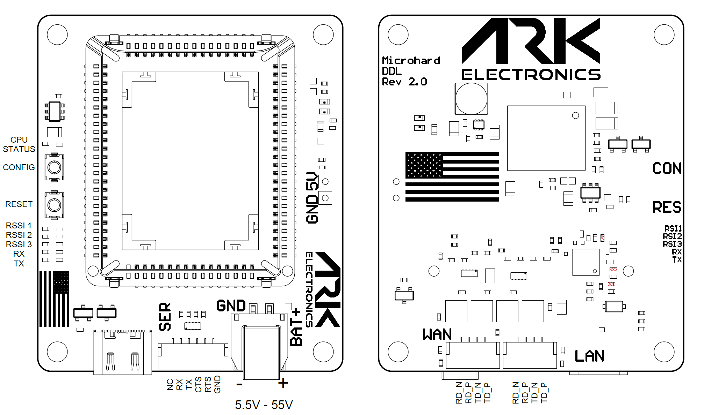

# ARK Microhard DDL Carrier

<figure><figcaption>
ARK Microhard DDL Carrier Connections
</figcaption></figure>

## Pinout

#### BAT - 2 Pin Molex Nano-Fit 1054301202 - Mates with [45130](https://www.molex.com/en-us/part-list/45130?physical_circuitsMaximum=%222%22\&physical_numberOfRows=%221%22)

<table><thead><tr><th width="134">Pin Number</th><th width="237">Signal Name</th><th>Voltage</th></tr></thead><tbody><tr><td>1</td><td>BAT_IN</td><td>5.5V - 55V</td></tr><tr><td>2</td><td>GND</td><td>GND</td></tr></tbody></table>

#### LAN - 4 Pin JST-GH

<table><thead><tr><th width="134">Pin Number</th><th width="237">Signal Name</th><th>Voltage</th></tr></thead><tbody><tr><td>1</td><td>LAN_RD_N</td><td>50V</td></tr><tr><td>2</td><td>LAN_RD_P</td><td>50V</td></tr><tr><td>3</td><td>LAN_TD_N</td><td>50V</td></tr><tr><td>4</td><td>LAN_TD_P</td><td>50V</td></tr></tbody></table>

#### WAN - 4 Pin JST-GH

<table><thead><tr><th width="134">Pin Number</th><th width="237">Signal Name</th><th>Voltage</th></tr></thead><tbody><tr><td>1</td><td>WAN_RD_N</td><td>50V</td></tr><tr><td>2</td><td>WAN_RD_P</td><td>50V</td></tr><tr><td>3</td><td>WAN_TD_N</td><td>50V</td></tr><tr><td>4</td><td>WAN_TD_P</td><td>50V</td></tr></tbody></table>

#### Serial - 6 Pin JST-GH

<table><thead><tr><th width="134">Pin Number</th><th width="237">Signal Name</th><th>Voltage</th></tr></thead><tbody><tr><td>1</td><td>No Connect</td><td>No Connect</td></tr><tr><td>2</td><td>FC_TX_OUT_RADIO_RX_IN_EXT</td><td>3.3V</td></tr><tr><td>3</td><td>FC_RX_IN_RADIO_TX_OUT_EXT</td><td>3.3V</td></tr><tr><td>4</td><td>FC_CTS_IN_RADIO_CTS_OUT_EXT</td><td>3.3V</td></tr><tr><td>5</td><td>FC_RTS_OUT_RADIO_RTS_IN_EXT</td><td>3.3V</td></tr><tr><td>6</td><td>GND</td><td>GND</td></tr></tbody></table>

## Assembly

1. Remove all connections from the board.
2. Place the thermal pad on the copper in the socket.
3. Insert the Microhard module with the antenna connectors nearest to the edge of the board.

## Disassembly

1. Remove all connections from the board.
2. Using a small screwdriver, pry the non-antenna connector corner from the socket. Being careful to not damage the PCB or socket. Prying against the metal RF shield works well.
3. Remove the thermal pad.

