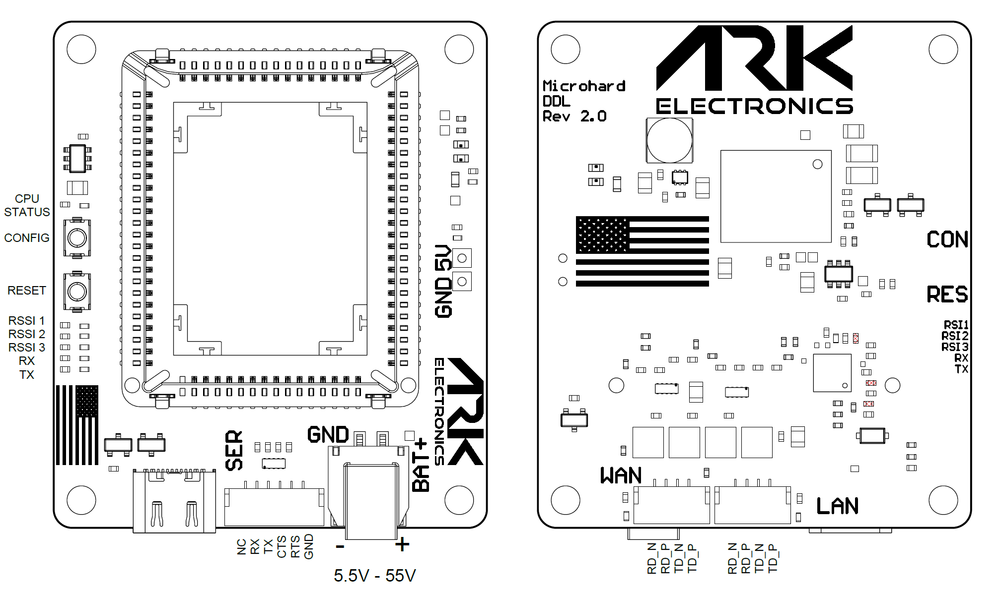

# Hardware Reference

## Specifications

| Specification | Value |
|---------------|-------|
| Radio socket | Microhard Pico |
| Supported modules | [pMDDL2460](https://www.microhardcorp.com/pMDDL2460.php), [pMDDL2550](https://www.microhardcorp.com/pMDDL2550.php), [pMDDL2450](https://www.microhardcorp.com/pMDDL2450.php), [pMDDL2350](https://www.microhardcorp.com/pMDDL2350.php), [pDDL1800](https://www.microhardcorp.com/pDDL1800.php), [pDDL900](https://www.microhardcorp.com/pDDL900.php) |
| Serial | Pixhawk standard, 6-pin JST-GH, 3.3 V UART |
| Ethernet | LAN and WAN ports, 4-pin JST-GH each |
| USB | USB-C: USB 2.0 data, USB Power Delivery sink, Ethernet over USB, serial over USB |
| Battery input | 5.5–55 V, 2-pin Molex Nano-Fit |
| Reverse polarity protection | Yes |
| Buttons | Configuration, reset |
| Fan | 5 V and GND pads |
| Weight | 18 g |

## Pinout

<figure><figcaption>
ARK Microhard DDL Carrier Connections
</figcaption></figure>

### Battery — 2-pin Molex Nano-Fit

Molex 1054301202. Mates with [45130](https://www.molex.com/en-us/part-list/45130?physical_circuitsMaximum=%222%22\&physical_numberOfRows=%221%22).

| Pin | Signal | Voltage |
|-----|--------|---------|
| 1 | BAT_IN | 5.5V - 55V |
| 2 | GND | GND |

### LAN — 4-pin JST-GH

| Pin | Signal | Voltage |
|-----|--------|---------|
| 1 | LAN_RD_N | 50V |
| 2 | LAN_RD_P | 50V |
| 3 | LAN_TD_N | 50V |
| 4 | LAN_TD_P | 50V |

### WAN — 4-pin JST-GH

| Pin | Signal | Voltage |
|-----|--------|---------|
| 1 | WAN_RD_N | 50V |
| 2 | WAN_RD_P | 50V |
| 3 | WAN_TD_N | 50V |
| 4 | WAN_TD_P | 50V |

### Serial — 6-pin JST-GH

| Pin | Signal | Voltage |
|-----|--------|---------|
| 1 | No Connect | No Connect |
| 2 | FC_TX_OUT_RADIO_RX_IN_EXT | 3.3V |
| 3 | FC_RX_IN_RADIO_TX_OUT_EXT | 3.3V |
| 4 | FC_CTS_IN_RADIO_CTS_OUT_EXT | 3.3V |
| 5 | FC_RTS_OUT_RADIO_RTS_IN_EXT | 3.3V |
| 6 | GND | GND |

## LEDs

Power, wireless TX and RX, RSSI and LAN link status.

## Assembly

1. Remove all connections from the board.
2. Place the thermal pad on the copper in the socket.
3. Insert the Microhard module with the antenna connectors nearest to the edge of the board.

## Disassembly

1. Remove all connections from the board.
2. Using a small screwdriver, pry the non-antenna connector corner from the socket. Being careful to not damage the PCB or socket. Prying against the metal RF shield works well.
3. Remove the thermal pad.

## 3D Model and Case

| File | Contents |
|------|----------|
| [ARK\_Microhard\_DDL\_Carrier\_Rev\_2.0.step](https://github.com/ARK-Electronics/ark-hardware/raw/main/ARK_Microhard_DDL_Carrier/model/ARK_Microhard_DDL_Carrier_Rev_2.0.step) | Board, rev 2.0 |
| [Microhard\_Case.step](https://github.com/ARK-Electronics/ark-hardware/raw/main/ARK_Microhard_DDL_Carrier/case/Microhard_Case.step) | Case |
| [Top\_Case.stl](https://github.com/ARK-Electronics/ark-hardware/raw/main/ARK_Microhard_DDL_Carrier/case/Top_Case.stl) | Case top |
| [Bottom\_Case.stl](https://github.com/ARK-Electronics/ark-hardware/raw/main/ARK_Microhard_DDL_Carrier/case/Bottom_Case.stl) | Case bottom |

All files: [ARK\_Microhard\_DDL\_Carrier in ark-hardware](https://github.com/ARK-Electronics/ark-hardware/tree/main/ARK_Microhard_DDL_Carrier)
